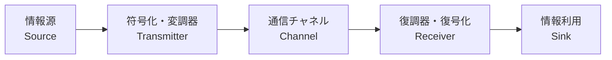

# 第1章 デジタル通信の基礎

## 1.1 デジタル通信とは

現代の情報社会において、通信は人々の生活を支える重要なインフラの一つです。  
なかでも、コンピュータやスマートフォンの普及とともに **デジタル通信**（ディジタル通信）の技術が急速に発展してきました。  
デジタル通信とは、情報を **ビット（0と1）** の形に変換して伝送する通信方式の総称です。

デジタル通信では、情報をいったん **ディジタル信号（離散的な値）** に置き換えます。これにより、誤り検出・訂正の仕組みを導入しやすくなり、ノイズに強い安定した通信が実現可能です。  
一方、アナログ通信では、音声や映像などを **連続的な波形** としてそのまま伝送します。

- **アナログ通信**: 信号を連続値で表現し、そのまま伝送する  
  （例: AMラジオ、FMラジオ、アナログ電話など）

- **デジタル通信**: 信号を0と1の離散値で表現し、符号化して伝送する  
  （例: Wi-Fi、LTE、5Gなど多くの現代通信方式）

---

## 1.2 アナログ通信との違い

### 1.2.1 ノイズや劣化への強さ

アナログ通信では、伝送経路に乗るノイズや雑音が信号そのものに重畳しやすく、  
長距離伝送や増幅のたびに徐々に品質が劣化します。  
一方、デジタル通信では信号を 0/1 のビット列で扱うため、  
**ある程度のノイズが乗ってもビットの誤りを検出・訂正**でき、品質を保ちやすい特徴があります。

### 1.2.2 符号化・暗号化の柔軟性

デジタル通信はビット列を操作するため、**圧縮技術**（音声や映像の圧縮）や  
**暗号化技術**を適用しやすく、多彩なサービスを高品質で実現できます。

### 1.2.3 帯域効率

デジタル通信では、適切な **変調方式** や **誤り制御符号** を組み合わせることで、  
限られた周波数帯域を最大限活用できます。  
これはアナログ通信では難しい柔軟性です。

---

## 1.3 デジタル通信システムの基本構成

デジタル通信は、大きく分けて以下のブロックから構成されます。

1. **情報源 (Source)**  
   送信したいデータ（音声、画像、テキストなど）

2. **符号化・変調器 (Transmitter)**  
   情報をビット列として表し、エラー検出・訂正用の符号（コーディング）を施した上で変調を行う

3. **通信チャネル (Channel)**  
   無線なら電波、有線ならケーブルなど、信号を伝送する経路  
   ノイズや干渉などにより信号は劣化する

4. **復調器・復号化 (Receiver)**  
   受信したアナログ波形を復調してビット列を取り出し、エラー訂正を行い、元のデータを復元する

5. **情報利用 (Sink)**  
   復元されたデータを実際に利用する（音声ならスピーカー再生など）

下図はデジタル通信システムの概念ブロック図です。

