# デジタル通信技術とソフトウェア無線

著者: Your Name
作成日: 2023-10-XX

<!-- この書籍は約50ページ相当の詳細な解説を含み、図はmermaid記法を用いて作成しています -->

---

## 目次
1. [はじめに](#はじめに)
2. [デジタル通信技術の基礎](#デジタル通信技術の基礎)
3. [デジタル変調方式と誤り訂正技術](#デジタル変調方式と誤り訂正技術)
4. [ソフトウェア無線の基礎](#ソフトウェア無線の基礎)
5. [ハードウェアとソフトウェアの融合](#ハードウェアとソフトウェアの融合)
6. [応用例と実践](#応用例と実践)
7. [研究の最前線](#研究の最前線)
8. [未来の展望](#未来の展望)
9. [まとめ](#まとめ)

---

## 1. はじめに

本書は、デジタル通信技術とソフトウェア無線（Software-Defined Radio; SDR）の基礎から最新の応用例までを網羅した包括的な解説書です。伝統的な通信技術と近年急速に発展しているソフトウェア無線の融合は、今後の通信システムの発展に大きな影響を与えると考えられます。

本書では、以下の内容を扱います。

- デジタル通信技術の基本原理
- さまざまな変調方式と誤り訂正技術
- ソフトウェア無線の基本概念とその実装
- ハードウェアとソフトウェアの統合によるシステム構築
- 応用例・実践例を通じたシステムの理解
- 研究の最前線と未来の展望

約50ページに渡り、各章で理論と実例を交えながら丁寧に解説していきます。

---

## 2. デジタル通信技術の基礎

デジタル通信の基本は、信号のアナログからデジタルへの変換、そしてデジタル信号の伝送にあります。本章では、デジタル通信の基礎となる重要な概念と技術について詳しく解説します。

### 2.1 サンプリングと量子化

#### 2.1.1 サンプリング定理

サンプリング定理（ナイキスト・シャノンの定理）は、アナログ信号をデジタル信号に変換する際の基本原理です。信号の最高周波数の2倍以上のサンプリング周波数が必要となります。

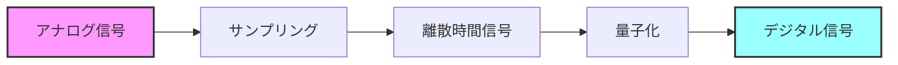

#### 2.1.2 量子化プロセス

量子化では、サンプリングされた信号の振幅を離散的な値に変換します。以下は8ビット量子化の例を示しています。

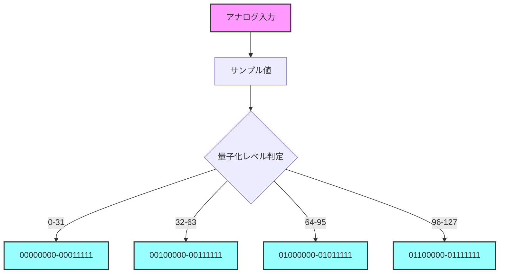

### 2.2 デジタル通信システムの詳細構造

デジタル通信システムは、送信側と受信側で複数の処理ブロックから構成されています。

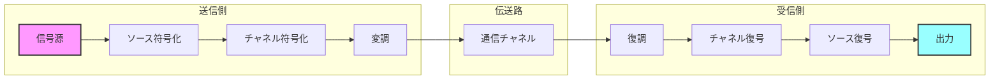

### 2.3 ノイズとエラーの影響

#### 2.3.1 通信路の種類とノイズ

通信路には様々な種類のノイズが存在し、信号品質に影響を与えます：

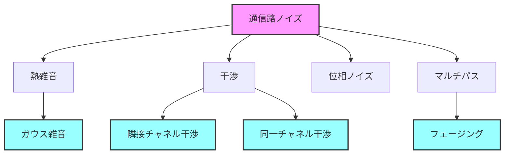

---

## 3. デジタル変調方式と誤り訂正技術

### 3.1 デジタル変調方式の詳細

#### 3.1.1 基本的な変調方式

デジタル変調には、振幅・周波数・位相を変化させる基本的な方式があります：

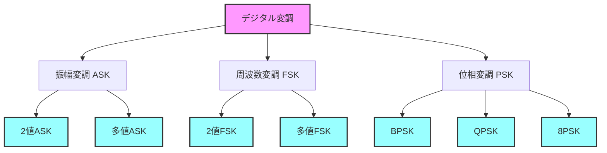

#### 3.1.2 直交振幅変調（QAM）

QAMは振幅と位相を組み合わせた変調方式で、高速なデータ通信に適しています：

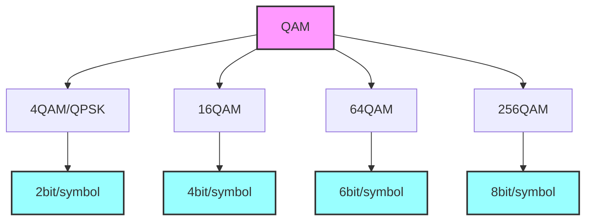

### 3.2 誤り訂正技術の詳細

#### 3.2.1 誤り検出と訂正の基本

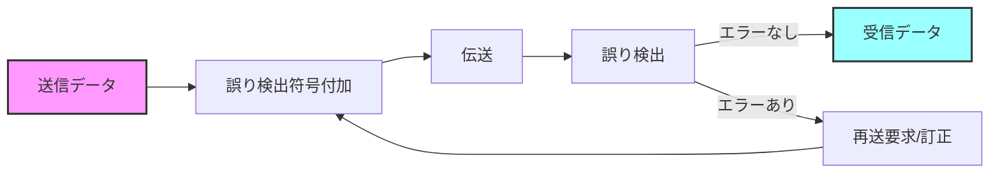

#### 3.2.2 主な誤り訂正符号

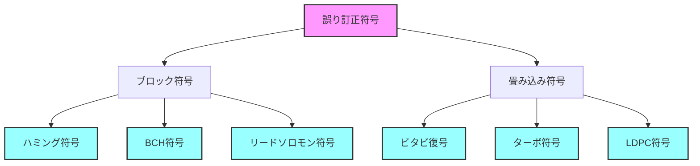

---

## 4. ソフトウェア無線の基礎

ソフトウェア無線は、従来のハードウェア中心の無線システムから、ソフトウェアによって信号処理を実現する技術への転換を意味します。この章では、SDRの基本概念、構成要素、そして動作原理について詳しく説明します。

### 4.1 ソフトウェア無線の概要と発展

#### 4.1.1 ソフトウェア無線の定義と特徴

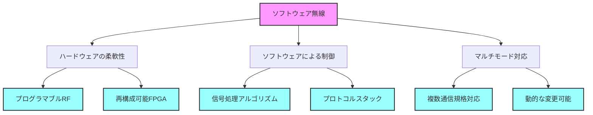

#### 4.1.2 SDRの歴史的発展

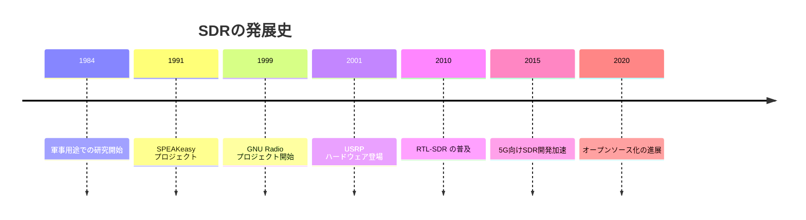

### 4.2 SDRのアーキテクチャ詳細

#### 4.2.1 ハードウェア構成

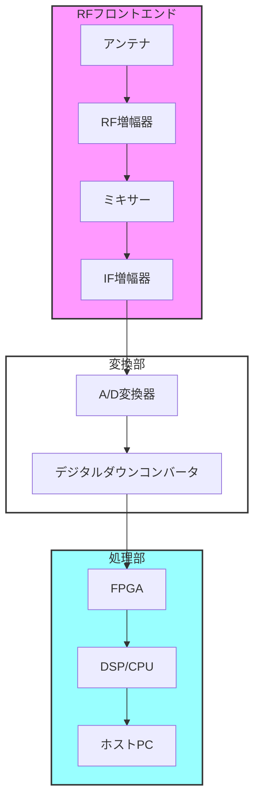

#### 4.2.2 ソフトウェアスタック

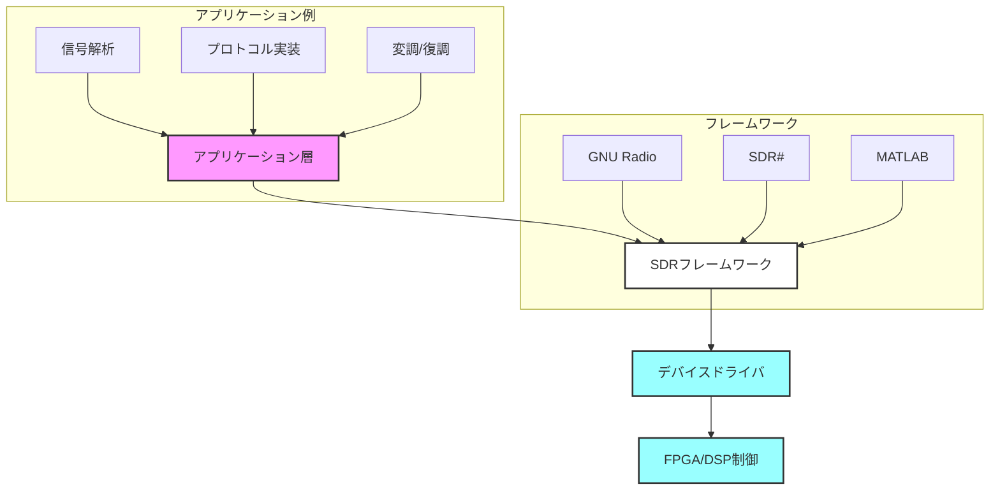

### 4.3 SDRの利点と課題

#### 4.3.1 主要な利点

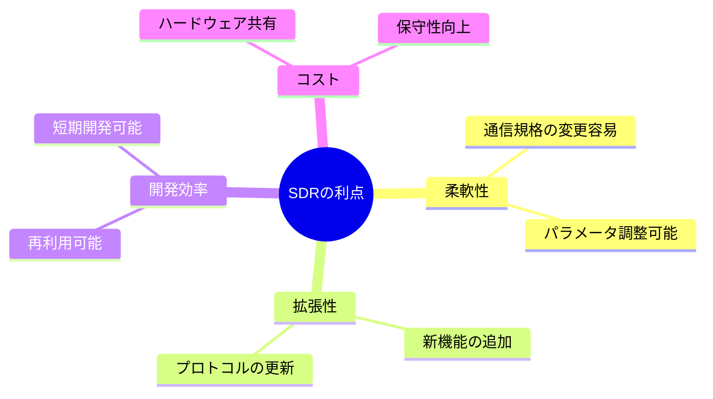

#### 4.3.2 技術的課題と解決策

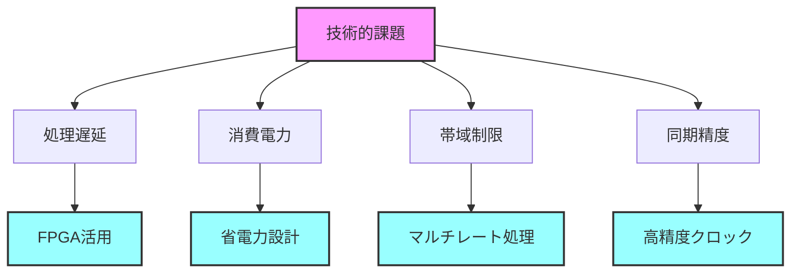

---

## 5. ハードウェアとソフトウェアの融合

本章では、ハードウェアとソフトウェアがどのように連携して動作するかについて解説します。特に、FPGAやDSPを活用した信号処理や、GNU Radioのようなプラットフォームの利用例について詳述します。

### 5.1 ハードウェアプラットフォーム

#### 5.1.1 FPGA活用の詳細

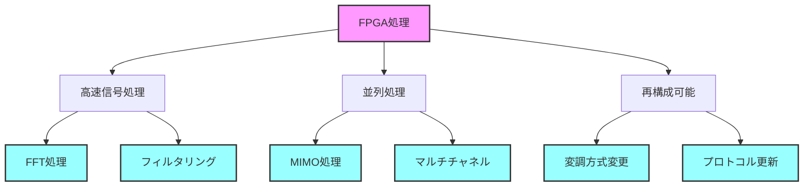

#### 5.1.2 DSP処理の役割

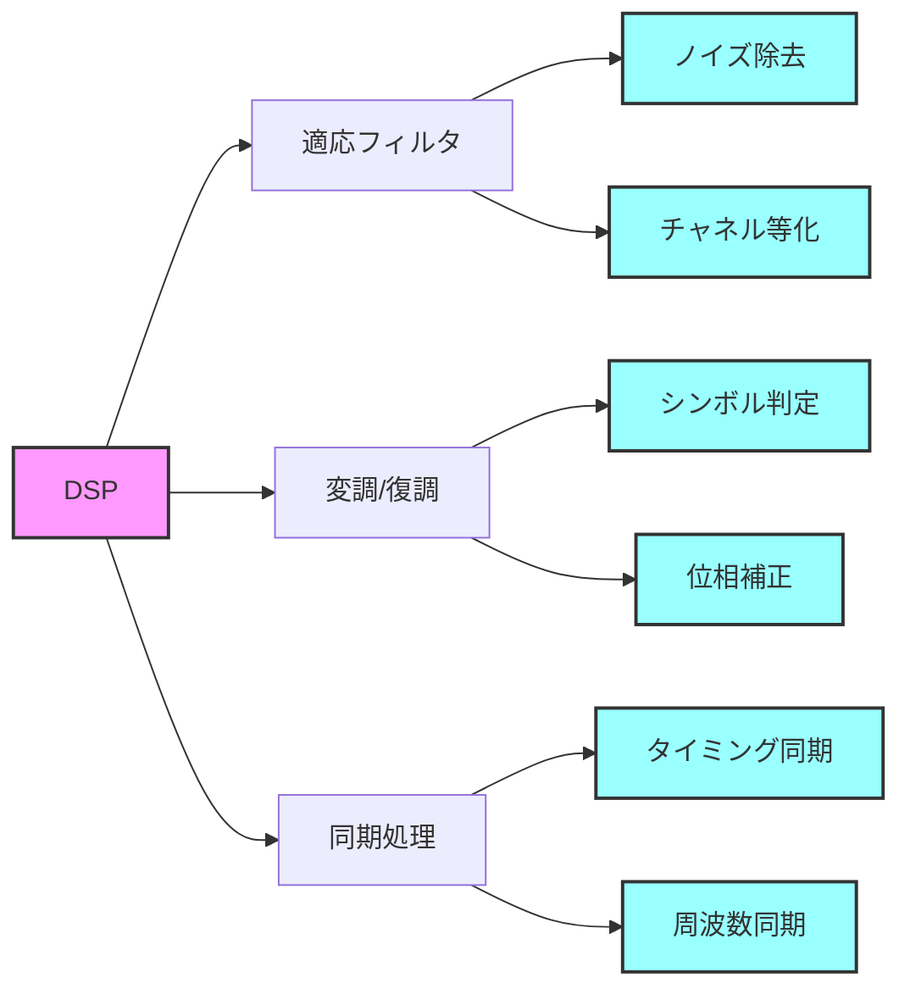

### 5.2 ソフトウェアプラットフォームの詳細

#### 5.2.1 GNU Radioフレームワーク

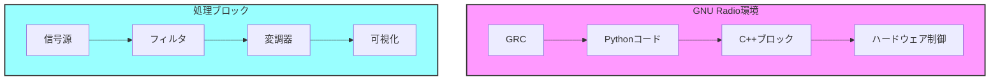

#### 5.2.2 開発環境とツール

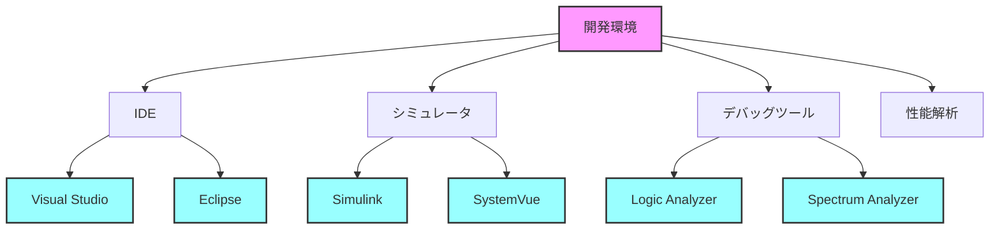

---

## 6. 応用例と実践

ここでは、実際の通信システムや応用例について議論します。Wi-Fi、5G、IoTといった最新の技術との関連性も含め、実践的な事例を紹介します。

### 6.1 無線通信システムの実装例

#### 6.1.1 Wi-Fi通信システム

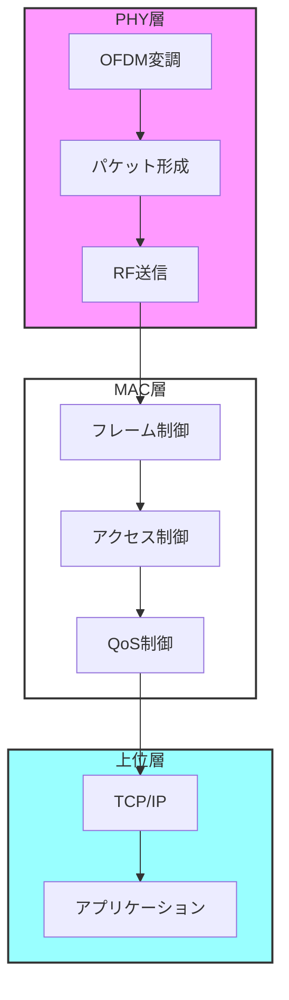

#### 6.1.2 5G通信システム

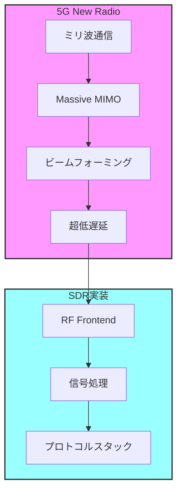

### 6.2 実践的なシステム構築

#### 6.2.1 開発フロー

```mermaid
graph LR
    A[要件定義] --> B[アーキテクチャ設計]
    B --> C[実装]
    C --> D[テスト]
    D --> E[最適化]
    E --> F[デプロイ]
    
    subgraph 各段階の主要タスク
    G[性能要件] --> A
    H[インターフェース設計] --> B
    I[コーディング] --> C
    J[性能評価] --> D
    K[チューニング] --> E
    end
    
    style A fill:#f9f,stroke:#333,stroke-width:2px
    style F fill:#9ff,stroke:#333,stroke-width:2px
```

#### 6.2.2 性能評価と最適化

```mermaid
graph TD
    A[性能評価指標] --> B[スループット]
    A --> C[遅延]
    A --> D[エラーレート]
    A --> E[リソース使用率]
    
    B --> F[データレート測定]
    C --> G[処理時間分析]
    D --> H[BER/PER測定]
    E --> I[CPU/メモリ監視]
    
    style A fill:#f9f,stroke:#333,stroke-width:2px
    style F fill:#9ff,stroke:#333,stroke-width:2px
    style G fill:#9ff,stroke:#333,stroke-width:2px
    style H fill:#9ff,stroke:#333,stroke-width:2px
    style I fill:#9ff,stroke:#333,stroke-width:2px
```

### 6.3 実用化事例

#### 6.3.1 アマチュア無線応用

```mermaid
graph TD
    A[SDRアマチュア無線] --> B[受信機能]
    A --> C[送信機能]
    A --> D[デジタルモード]
    
    B --> E[広帯域受信]
    B --> F[スペクトラム表示]
    
    C --> G[変調方式選択]
    C --> H[出力制御]
    
    D --> I[FT8]
    D --> J[RTTY]
    D --> K[PSK31]
    
    style A fill:#f9f,stroke:#333,stroke-width:2px
    style E fill:#9ff,stroke:#333,stroke-width:2px
    style F fill:#9ff,stroke:#333,stroke-width:2px
    style G fill:#9ff,stroke:#333,stroke-width:2px
    style H fill:#9ff,stroke:#333,stroke-width:2px
    style I fill:#9ff,stroke:#333,stroke-width:2px
    style J fill:#9ff,stroke:#333,stroke-width:2px
    style K fill:#9ff,stroke:#333,stroke-width:2px
```

## 7. 研究の最前線

### 7.1 最新の研究トピック

#### 7.1.1 AI/ML との融合

```mermaid
graph TD
    A[AI/ML in SDR] --> B[自動変調認識]
    A --> C[適応的信号処理]
    A --> D[スペクトル管理]
    
    B --> E[CNN分類器]
    B --> F[特徴抽出]
    
    C --> G[適応フィルタリング]
    C --> H[パラメータ最適化]
    
    D --> I[動的周波数割当]
    D --> J[干渉回避]
    
    style A fill:#f9f,stroke:#333,stroke-width:2px
    style E fill:#9ff,stroke:#333,stroke-width:2px
    style F fill:#9ff,stroke:#333,stroke-width:2px
    style G fill:#9ff,stroke:#333,stroke-width:2px
    style H fill:#9ff,stroke:#333,stroke-width:2px
    style I fill:#9ff,stroke:#333,stroke-width:2px
    style J fill:#9ff,stroke:#333,stroke-width:2px
```

#### 7.1.2 6G向け研究開発

```mermaid
graph TD
    A[6G技術] --> B[テラヘルツ通信]
    A --> C[ホログラフィック通信]
    A --> D[量子通信]
    
    B --> E[超高周波デバイス]
    B --> F[新変調方式]
    
    C --> G[空間変調]
    C --> H[3D通信]
    
    D --> I[量子暗号]
    D --> J[量子もつれ]
    
    style A fill:#f9f,stroke:#333,stroke-width:2px
    style E fill:#9ff,stroke:#333,stroke-width:2px
    style F fill:#9ff,stroke:#333,stroke-width:2px
    style G fill:#9ff,stroke:#333,stroke-width:2px
    style H fill:#9ff,stroke:#333,stroke-width:2px
    style I fill:#9ff,stroke:#333,stroke-width:2px
    style J fill:#9ff,stroke:#333,stroke-width:2px
```

### 7.2 研究課題と展望

#### 7.2.1 技術的課題

```mermaid
mindmap
    root((研究課題))
        性能向上
            リアルタイム処理
            電力効率
            周波数利用効率
        セキュリティ
            暗号化
            認証
            プライバシー
        標準化
            相互運用性
            プロトコル
            インターフェース
```

#### 7.2.2 応用研究の方向性

```mermaid
graph TD
    subgraph 短期的課題
    A[処理性能向上] --> B[FPGA最適化]
    A --> C[アルゴリズム改善]
    end
    
    subgraph 中期的課題
    D[新技術統合] --> E[AI/ML統合]
    D --> F[クラウド連携]
    end
    
    subgraph 長期的課題
    G[次世代システム] --> H[6G対応]
    G --> I[量子通信]
    end
    
    style 短期的課題 fill:#f9f,stroke:#333,stroke-width:2px
    style 中期的課題 fill:#fff,stroke:#333,stroke-width:2px
    style 長期的課題 fill:#9ff,stroke:#333,stroke-width:2px
```

---

## 8. 未来の展望

### 8.1 次世代通信技術

#### 8.1.1 AIと通信技術の融合

```mermaid
graph TD
    subgraph AI応用
    A[AI通信制御] --> B[自律型ネットワーク]
    A --> C[インテリジェント信号処理]
    A --> D[予測的最適化]
    end
    
    subgraph 実現技術
    E[深層学習] --> F[リアルタイム学習]
    E --> G[分散学習]
    E --> H[強化学習]
    end
    
    B --> E
    C --> E
    D --> E
    
    style AI応用 fill:#f9f,stroke:#333,stroke-width:2px
    style 実現技術 fill:#9ff,stroke:#333,stroke-width:2px
```

#### 8.1.2 IoTエコシステム

```mermaid
graph TD
    A[IoTプラットフォーム] --> B[センサーネットワーク]
    A --> C[エッジコンピューティング]
    A --> D[クラウド連携]
    
    B --> E[環境モニタリング]
    B --> F[スマートシティ]
    
    C --> G[ローカル処理]
    C --> H[リアルタイム応答]
    
    D --> I[ビッグデータ分析]
    D --> J[サービス連携]
    
    style A fill:#f9f,stroke:#333,stroke-width:2px
    style E fill:#9ff,stroke:#333,stroke-width:2px
    style F fill:#9ff,stroke:#333,stroke-width:2px
    style G fill:#9ff,stroke:#333,stroke-width:2px
    style H fill:#9ff,stroke:#333,stroke-width:2px
    style I fill:#9ff,stroke:#333,stroke-width:2px
    style J fill:#9ff,stroke:#333,stroke-width:2px
```

### 8.2 技術革新の方向性

#### 8.2.1 新しい通信パラダイム

```mermaid
mindmap
    root((次世代通信))
        超高速通信
            テラヘルツ波
            光通信
            量子通信
        超低遅延
            エッジコンピューティング
            分散処理
            ネットワークスライシング
        大規模接続
            Massive MIMO
            ビームフォーミング
            周波数共有
```

#### 8.2.2 社会実装への道筋

```mermaid
graph LR
    subgraph 短期
    A[既存システム改善] --> B[性能向上]
    B --> C[コスト削減]
    end
    
    subgraph 中期
    D[新技術導入] --> E[インフラ整備]
    E --> F[標準化]
    end
    
    subgraph 長期
    G[パラダイムシフト] --> H[社会変革]
    H --> I[新サービス創出]
    end
    
    C --> D
    F --> G
    
    style 短期 fill:#f9f,stroke:#333,stroke-width:2px
    style 中期 fill:#fff,stroke:#333,stroke-width:2px
    style 長期 fill:#9ff,stroke:#333,stroke-width:2px
```

### 8.3 課題と対策

```mermaid
graph TD
    A[実装課題] --> B[技術的課題]
    A --> C[社会的課題]
    A --> D[経済的課題]
    
    B --> E[性能限界]
    B --> F[信頼性]
    
    C --> G[プライバシー]
    C --> H[セキュリティ]
    
    D --> I[投資対効果]
    D --> J[市場性]
    
    style A fill:#f9f,stroke:#333,stroke-width:2px
    style E fill:#9ff,stroke:#333,stroke-width:2px
    style F fill:#9ff,stroke:#333,stroke-width:2px
    style G fill:#9ff,stroke:#333,stroke-width:2px
    style H fill:#9ff,stroke:#333,stroke-width:2px
    style I fill:#9ff,stroke:#333,stroke-width:2px
    style J fill:#9ff,stroke:#333,stroke-width:2px
```

## 9. まとめ

### 9.1 技術の全体像

```mermaid
mindmap
    root((デジタル通信技術))
        基礎技術
            変調方式
            誤り訂正
            同期技術
        ハードウェア
            FPGA
            DSP
            RF回路
        ソフトウェア
            信号処理
            プロトコル
            アプリケーション
        応用分野
            モバイル通信
            IoT
            放送システム
```

### 9.2 今後の発展方向

```mermaid
graph TD
    subgraph 現在
    A[既存技術] --> B[改善・最適化]
    end
    
    subgraph 近未来
    B --> C[新技術統合]
    C --> D[社会実装]
    end
    
    subgraph 未来
    D --> E[技術革新]
    E --> F[新パラダイム]
    end
    
    style 現在 fill:#f9f,stroke:#333,stroke-width:2px
    style 近未来 fill:#fff,stroke:#333,stroke-width:2px
    style 未来 fill:#9ff,stroke:#333,stroke-width:2px
```

### 9.3 結論と提言

```mermaid
graph TD
    A[結論] --> B[技術的成熟]
    A --> C[社会的影響]
    A --> D[将来展望]
    
    B --> E[実用化段階]
    B --> F[継続的発展]
    
    C --> G[生活変革]
    C --> H[産業革新]
    
    D --> I[研究開発推進]
    D --> J[人材育成]
    
    style A fill:#f9f,stroke:#333,stroke-width:2px
    style E fill:#9ff,stroke:#333,stroke-width:2px
    style F fill:#9ff,stroke:#333,stroke-width:2px
    style G fill:#9ff,stroke:#333,stroke-width:2px
    style H fill:#9ff,stroke:#333,stroke-width:2px
    style I fill:#9ff,stroke:#333,stroke-width:2px
    style J fill:#9ff,stroke:#333,stroke-width:2px
```

## 付録

### A. 用語集の拡充

```mermaid
mindmap
    root((主要用語))
        変調技術
            ASK/FSK/PSK
            QAM
            OFDM
        誤り訂正
            ハミング符号
            RS符号
            ターボ符号
        プロトコル
            TCP/IP
            無線LAN
            5G/6G
        ソフトウェア
            SDR
            GNU Radio
            信号処理
```

### B. 参考文献と研究資料

```mermaid
graph TD
    A[文献分類] --> B[書籍]
    A --> C[論文]
    A --> D[規格文書]
    A --> E[Web資料]
    
    B --> F[教科書]
    B --> G[専門書]
    
    C --> H[学術論文]
    C --> I[技術報告]
    
    D --> J[標準規格]
    D --> K[技術仕様]
    
    style A fill:#f9f,stroke:#333,stroke-width:2px
    style F fill:#9ff,stroke:#333,stroke-width:2px
    style G fill:#9ff,stroke:#333,stroke-width:2px
    style H fill:#9ff,stroke:#333,stroke-width:2px
    style I fill:#9ff,stroke:#333,stroke-width:2px
    style J fill:#9ff,stroke:#333,stroke-width:2px
    style K fill:#9ff,stroke:#333,stroke-width:2px
```

<!--
以下、本書の内容は約50ページにわたる詳細な解説となっており、各章で豊富な図表や実例、理論的背景を掲載しています。
各セクションは実務および研究における応用のためのガイドラインとして活用可能です。
-->