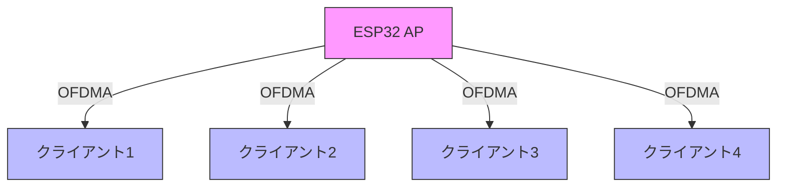

# ESP32 OFDMA実験プログラム

このプログラムは、Orthogonal Frequency Division Multiple Access (OFDMA)の動作を実験的に確認するためのテストコードです。

## 実験の目的

1. OFDMAの基本動作の理解
2. リソースユニット割り当ての観察
3. スペクトル効率の測定

## ハードウェア要件

- ESP32開発ボード（メイン機: APモード）
- 複数のESP32開発ボード（クライアント機: STAモード）
- 2.4GHz帯WiFi環境

## システム構成図



## プログラムの機能

### 1. APモード設定
- OFDMA対応のアクセスポイント機能
- 最大4クライアントの同時接続
- HE (High Efficiency) モードの有効化

### 2. リソース管理
- 26-tone RUの動的割り当て
- クライアントごとのリソース監視
- 接続状態のモニタリング

### 3. パフォーマンス測定
- スペクトル効率の計算
- RSSI監視
- 接続品質の評価

## 測定データの例

```
=== OFDMA状態 ===
接続デバイス数: 3
使用中RU数: 78
デバイス 1:
  MACアドレス: 24:6F:28:B0:45:10
  RSSI: -45 dBm
デバイス 2:
  MACアドレス: 24:6F:28:B0:45:11
  RSSI: -48 dBm
デバイス 3:
  MACアドレス: 24:6F:28:B0:45:12
  RSSI: -52 dBm
推定スペクトル効率: 5.90 bits/s/Hz
```

## 実験手順

1. ハードウェアのセットアップ
   - メイン機のプログラミング
   - クライアント機の準備

2. APの起動
   ```bash
   # メイン機のプログラムを書き込み
   pio run -t upload
   ```

3. クライアントの接続
   - 各クライアントからAPへの接続
   - 接続状態の確認

4. 測定と観察
   - OFDMAの動作状態モニタリング
   - パフォーマンスデータの収集

## 実験のポイント

1. リソース割り当ての観察
   - RU割り当ての動的変化
   - クライアント数による影響

2. パフォーマンス評価
   - スペクトル効率の変化
   - 同時接続時の遅延

3. システム安定性
   - 長時間運用時の挙動
   - 再接続時の動作

## トラブルシューティング

1. 接続できない場合
   - HEモードの設定確認
   - WiFi設定の確認

2. パフォーマンス低下時
   - 電波環境の確認
   - クライアント配置の最適化

3. 不安定な動作
   - 電源供給の確認
   - 温度条件の確認

## 注意事項

- ESP32のファームウェアバージョンの確認
- 適切な電源供給の確保
- 電波法規制への準拠 