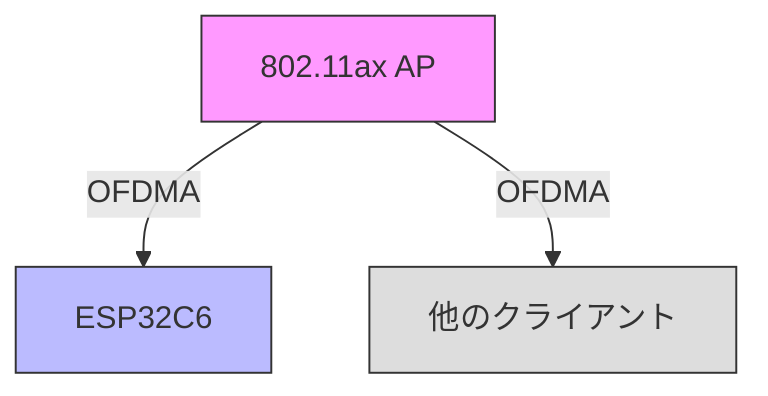

# ESP32C6 OFDMA実験プログラム

このプログラムは、ESP32C6を使用してOrthogonal Frequency Division Multiple Access (OFDMA)の動作を実験的に確認するためのテストコードです。ESP32C6はクライアントモードでのみOFDMAをサポートしています。

## 実験の目的

1. 802.11ax APとの接続確認
2. OFDMAリソース利用状況の観察
3. 通信品質の測定

## ハードウェア要件

- ESP32C6開発ボード（クライアントモード）
- 802.11ax対応AP（市販品）
- 2.4GHz帯WiFi環境

## システム構成図



## プログラムの機能

### 1. 802.11ax接続
- HEモード（802.11ax）での接続
- 接続状態のモニタリング
- APの性能情報取得

### 2. パフォーマンス測定
- 信号強度（RSSI）の監視
- スペクトル効率の推定
- 接続品質の評価

### 3. HE機能の確認
- OFDMA対応状況
- MU-MIMO対応
- BSS Color情報

## 測定データの例

```
=== 接続状態 ===
SSID: WiFi6_AP_Test
チャンネル: 1
RSSI: -45 dBm
MACアドレス: 24:6F:28:B0:45:10
IPアドレス: 192.168.1.100

=== APの性能 ===
802.11ax対応: Yes
OFDMA有効: Yes

=== HE (802.11ax) 機能 ===
MU-MIMO対応: Yes
最大空間ストリーム: 4
BSS Color: 32

推定スペクトル効率: 9.60 bits/s/Hz
```

## 実験手順

1. ハードウェアのセットアップ
   - ESP32C6の接続
   - 802.11ax APの設定

2. プログラムの書き込み
   ```bash
   pio run -t upload
   ```

3. 動作確認
   ```bash
   pio device monitor
   ```

4. 測定と観察
   - 接続状態の確認
   - パフォーマンスデータの収集

## 実験のポイント

1. 接続品質の評価
   - RSSI値の変動
   - スペクトル効率の変化

2. HE機能の確認
   - OFDMAの動作状況
   - MU-MIMOの効果

3. パフォーマンス比較
   - 従来モードとの違い
   - 複数クライアント環境での挙動

## トラブルシューティング

1. 接続できない場合
   - APの802.11ax設定確認
   - チャンネル設定の確認

2. パフォーマンス低下時
   - 電波環境の確認
   - 他のクライアントの影響確認

3. HE機能が有効にならない
   - APの設定確認
   - ファームウェアバージョンの確認

## 注意事項

- ESP32C6のファームウェアが最新であることを確認
- APが802.11axモードで動作していることを確認
- 測定環境の電波状況に注意 