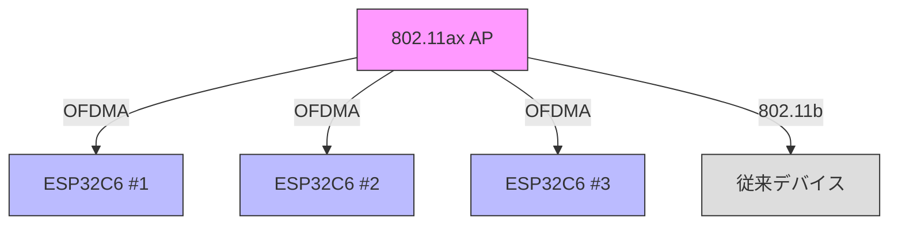
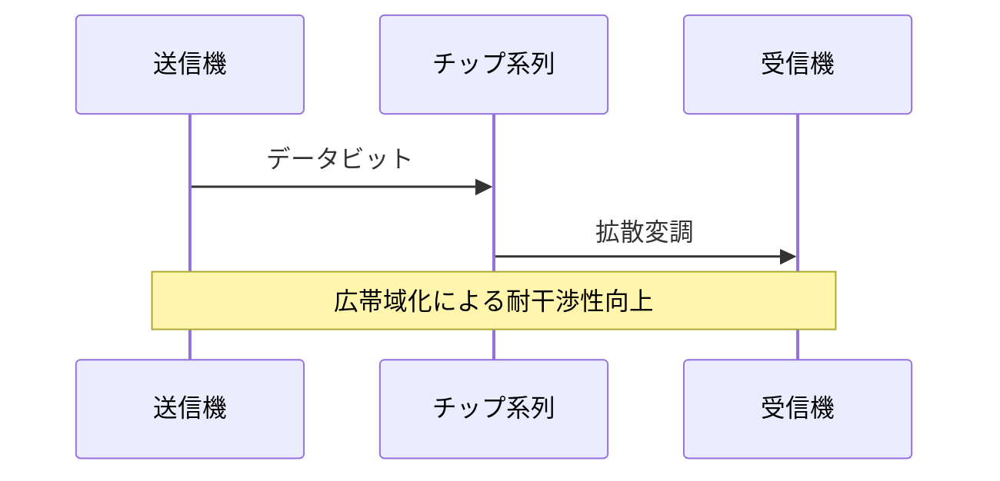
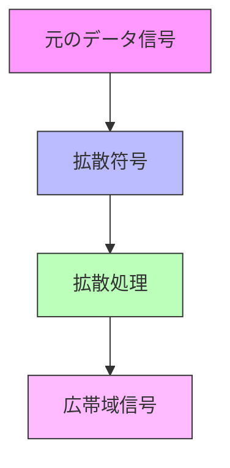
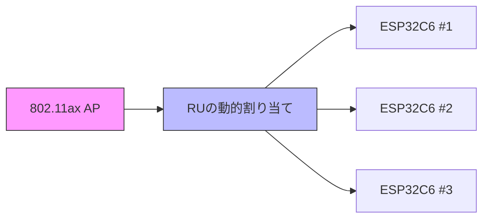
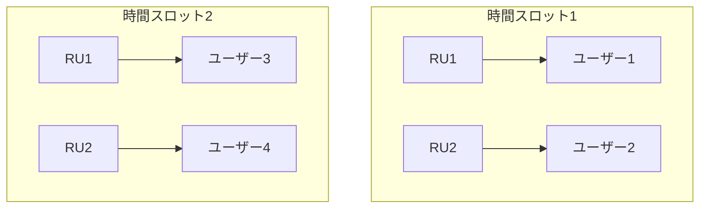
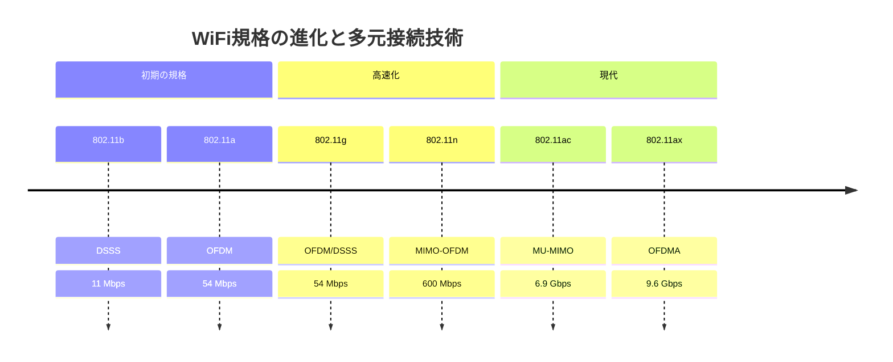
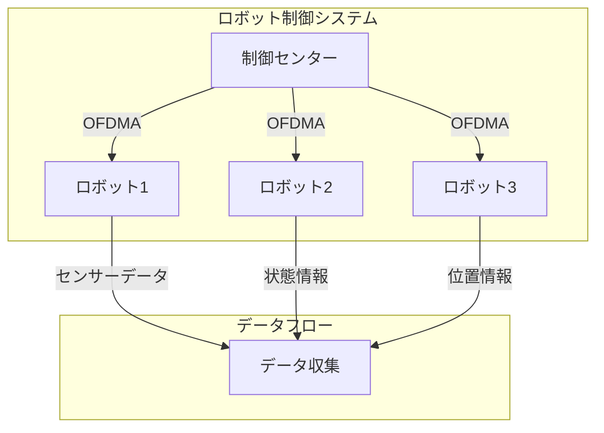
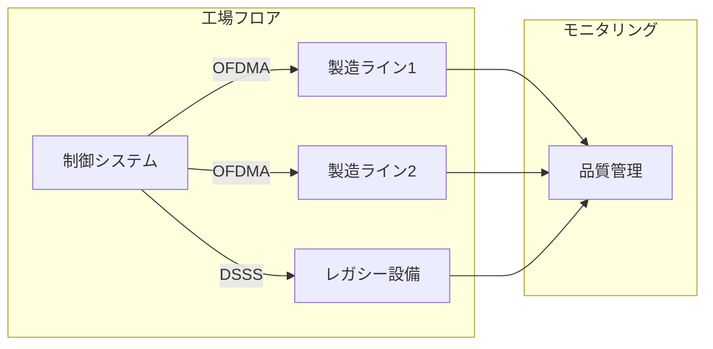
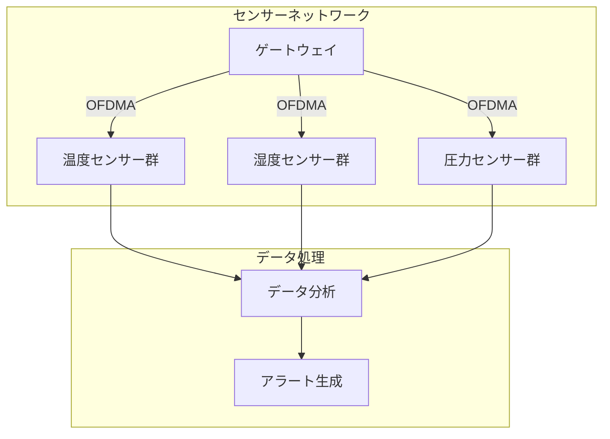
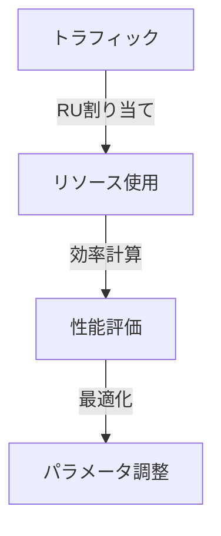

# ロボットやIoTデバイスのための多元接続技術

このリポジトリでは、ロボットやIoTデバイスで使用される多元接続技術について、理論と実践の両面から学ぶことができます。

## 目次

1. [はじめに](#はじめに)
2. [多元接続技術の基礎](#多元接続技術の基礎)
3. [IEEE 802.11規格における多元接続](#IEEE-80211規格における多元接続)
4. [実装例とテストコード](#実装例とテストコード)
5. [応用例と実践](#応用例と実践)
6. [セットアップガイド](#セットアップガイド)

## はじめに

多元接続技術は、複数のデバイスが同時に通信を行うための重要な技術です。本ドキュメントでは、特にIoTデバイスやロボットに焦点を当てて、実践的な理解を深めていきます。

### システム構成図



### ハードウェア構成

- **アクセスポイント**: 市販の802.11ax対応AP
- **クライアント**: ESP32C6開発ボード（802.11ax STAモード対応）
- **従来機器**: 802.11b/g/n対応デバイス

## 多元接続技術の基礎

### DSSS (Direct Sequence Spread Spectrum)
IEEE 802.11bで採用されている拡散変調方式です。

#### DSSの動作原理



#### スペクトラム拡散の仕組み



#### 特徴と利点
- 耐干渉性の向上
- セキュリティの向上
- 周波数の有効利用

### OFDMA (Orthogonal Frequency Division Multiple Access)
IEEE 802.11axで導入された次世代の多元接続技術です。ESP32C6ではクライアントモードでOFDMAを利用できます。

#### 周波数リソースの割り当て



#### 時間-周波数リソース割り当て



#### OFDMAの特徴
- 高効率な周波数利用
- 低遅延性
- 柔軟なリソース割り当て

### 802.11規格の進化



## 応用例と実践

### ロボット制御での活用



### スマートファクトリーでの実装



### IoTセンサーネットワーク



## 実装例とテストコード

本リポジトリには、以下の実装例が含まれています：

### 1. 基本的なWiFiテスト
- 接続状態のモニタリング
- 信号強度の測定
- PHYモードの検出

### 2. DSSS実験
- Barkerコードによる拡散
- SNR測定
- 干渉耐性の評価

### 3. OFDMA実験（クライアントモード）
- 802.11ax APへの接続
- リソースユニットの利用状況モニタリング
- スペクトル効率の測定

### プロジェクト構造
```
/
├── basic_dsss/
├── ofdma_test/
└── esp32_wifi/
```

## セットアップガイド

### 必要な環境
- PlatformIO IDE
- ESP32C6開発ボード
- 802.11ax対応AP（市販品）
- Arduino Framework

### インストール手順
1. VSCodeにPlatformIOをインストール
2. 本リポジトリをクローン
3. プロジェクトをPlatformIOで開く
4. 802.11ax APを設定

### APの要件
- IEEE 802.11ax（Wi-Fi 6）対応
- OFDMAの有効化
- 2.4GHz帯のサポート

## 実験結果の解析

### 1. DSSS性能評価


### 2. OFDMA効率分析



## ライセンス

このプロジェクトはMITライセンスの下で公開されています。
