# Mermaid 図 一括ファイル

---

## 1. 無線LANの基本構成例

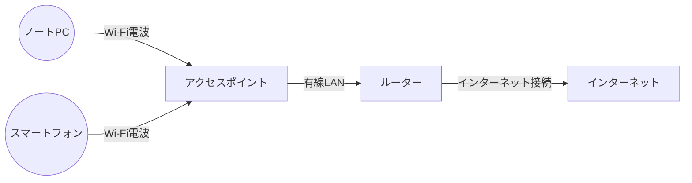

---

## 2. OSI参照モデル（例）

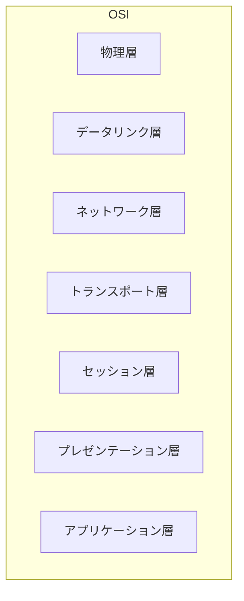

---

## 3. IPアドレスとサブネット分割イメージ

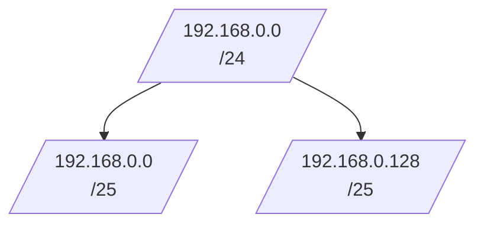

---

## 4. 無線LANと有線LANの比較図

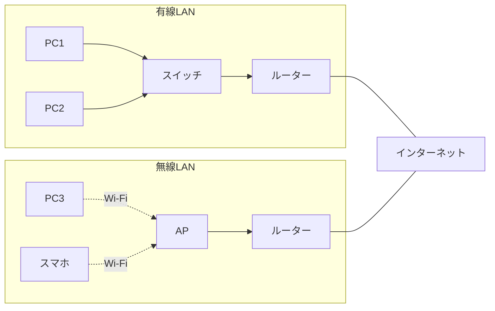

---

## 5. LAN内通信（スイッチ）の流れ

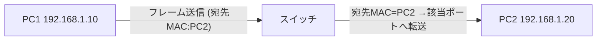

---

## 6. ルータによるネットワーク間通信

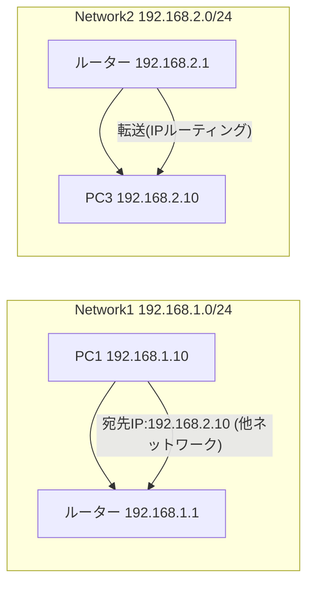

---

## 7. DHCPのDORAシーケンス

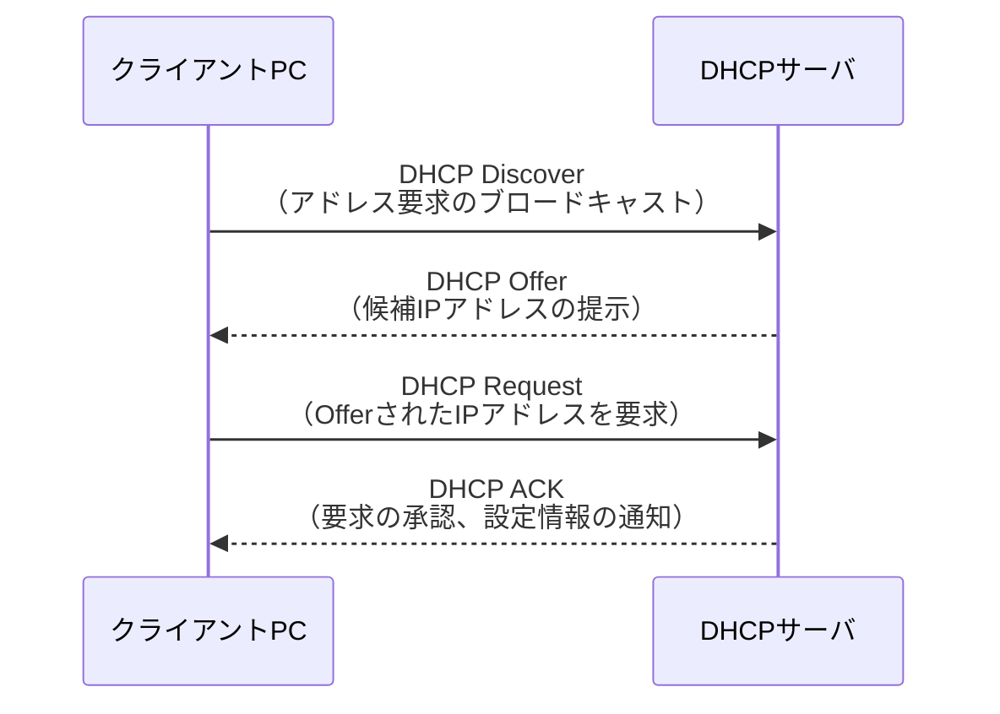

---

## 8. DNS問い合わせの基本シーケンス

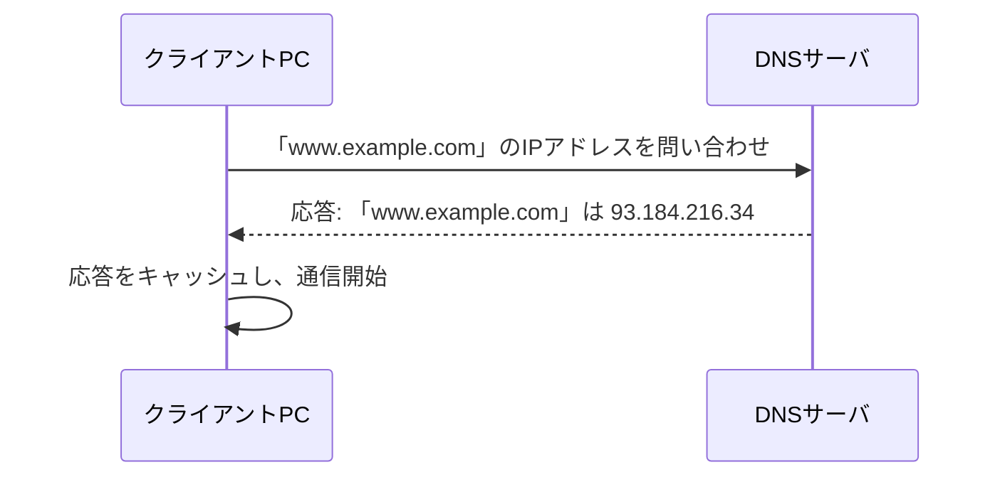

---

## 9. NATの変換イメージ

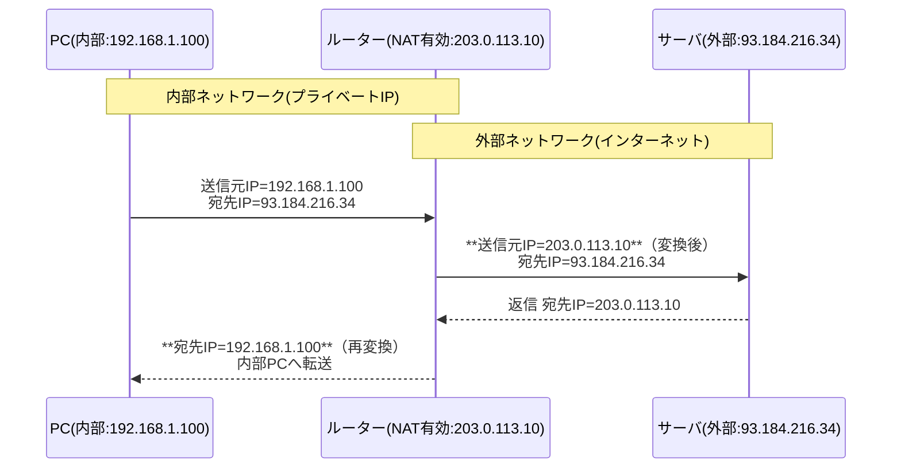

---

## 10. 802.1X認証（RADIUS）のイメージ

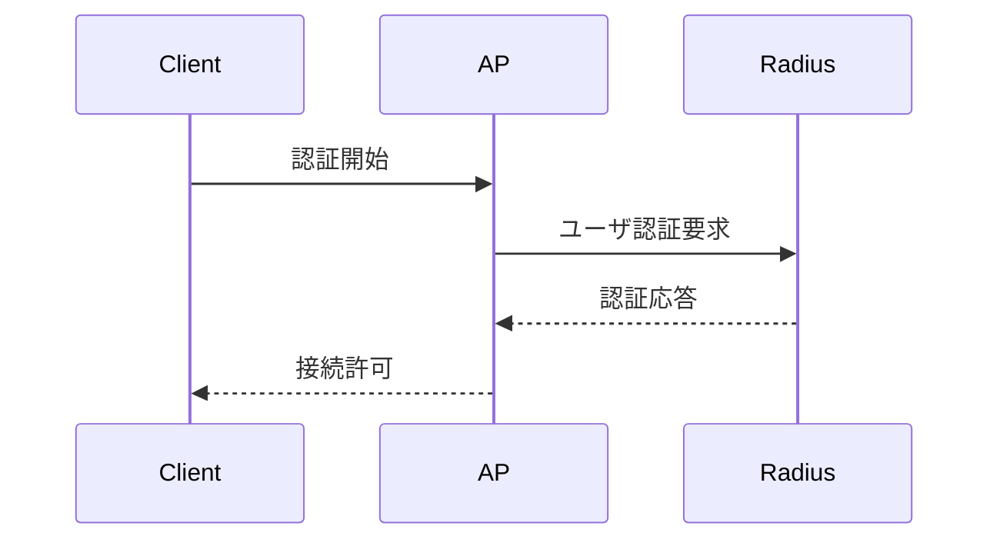

---

## 11. VLANによるネットワーク分割イメージ

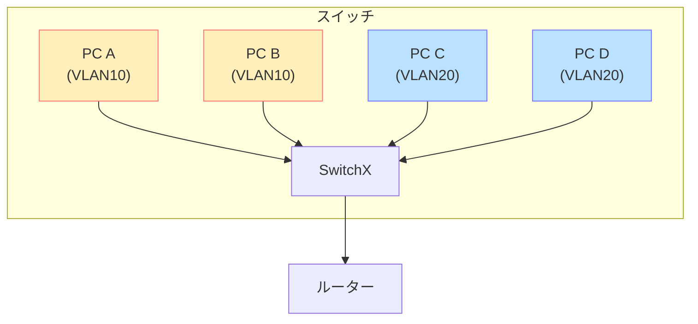

---

## 12. ルーティングプロトコルのイメージ

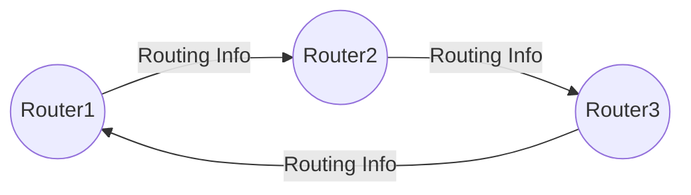

---

## 13. 小規模オフィスネットワークの例

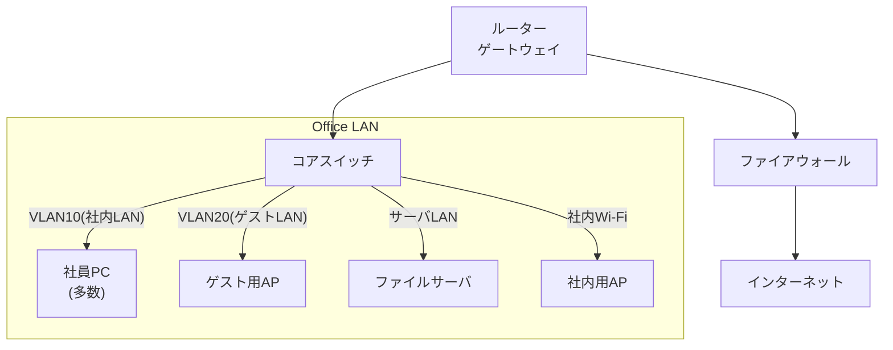

---

## 14. 障害切り分けフローチャート例

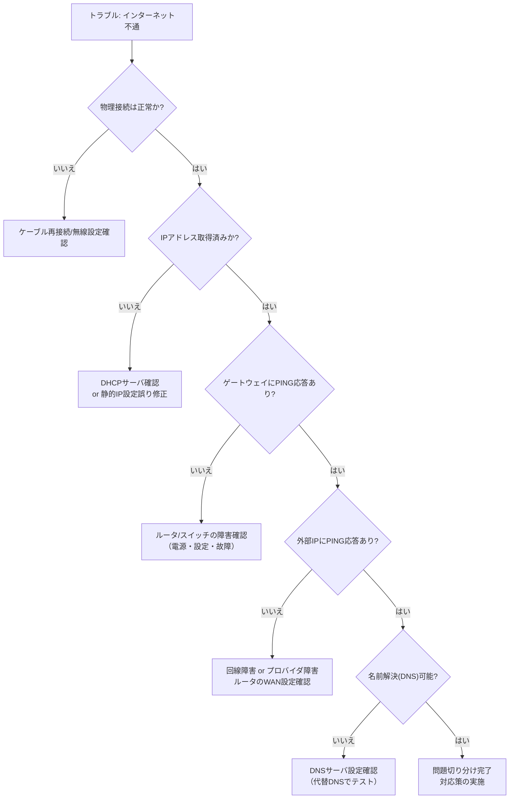
---

## 15. SNMPによる監視シーケンス例

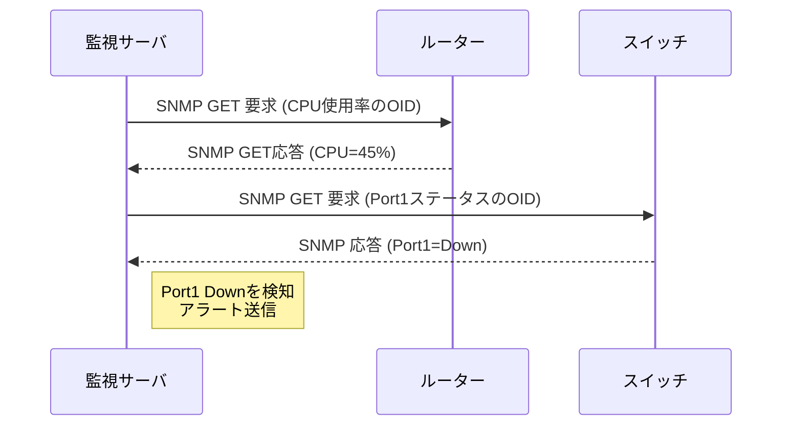

---

