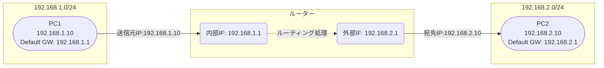
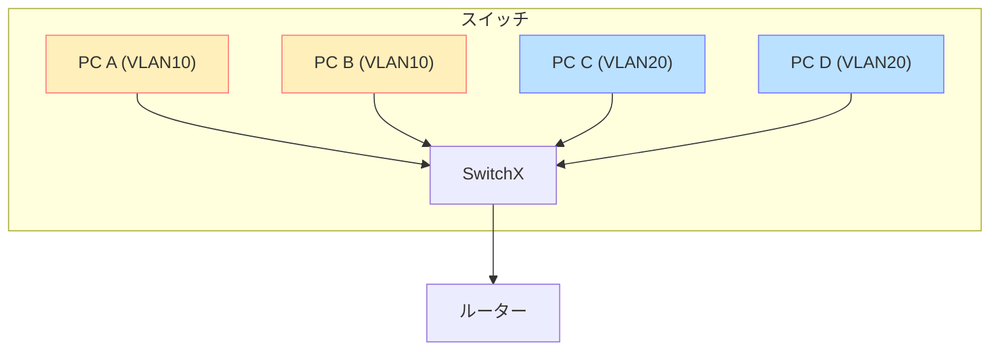
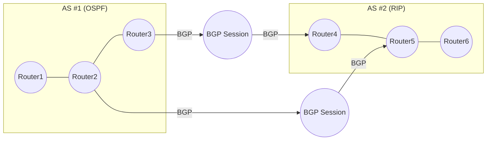
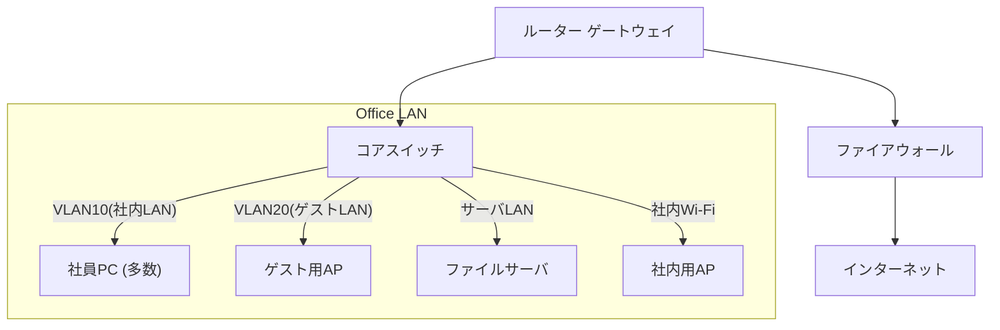
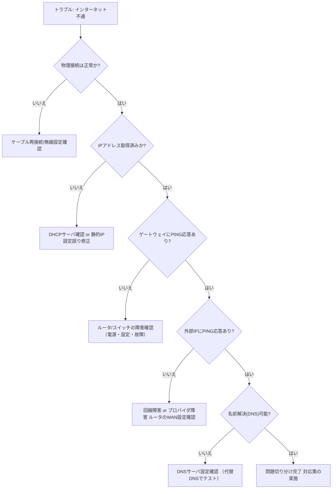

# Mermaid 図 一括ファイル

---

## 1. 無線LANの基本構成例

---

## 2. OSI参照モデル（例）

---

## 3. IPアドレスとサブネット分割イメージ

---

## 4. 無線LANと有線LANの比較図

---

## 5. LAN内通信（スイッチ）の流れ

---

## 6. ルータによるネットワーク間通信（再考）

---

## 7. DHCPのDORAシーケンス

---

## 8. DNS問い合わせの基本シーケンス

---

## 9. NATの変換イメージ

---

## 10. 802.1X認証（RADIUS）のイメージ

---

## 11. VLANによるネットワーク分割イメージ

---

## 12. ルーティングプロトコルのイメージ（改良）

次の図では、複数のルーターが異なるルーティングプロトコルで相互接続されている例を示します。AS#1 (Autonomous System) はOSPFを使用し、AS#2はRIPを使用してそれぞれが内部で経路交換を行い、ASを越えたルーティング情報はBGPを介して交換しています。このように、大規模ネットワークでは用途や設計ポリシーに応じて複数のプロトコルが組み合わさることが多いです。

上記の図で示したポイント:  
1. **AS #1 (OSPF)**: Autonomous System内でOSPFルータが連動して、内部経路をリンク状態ベースで交換。  
2. **AS #2 (RIP)**: 別のASでは古典的なRIPを使ってホップ数ベースの経路交換を行っている。  
3. **BGPの利用**: AS間のルータ間ではBGPセッションを確立し、OSPF側とRIP側のネットワークを相互に到達可能にしている。  

#### なぜ複数プロトコルを使うことがあるのか？
- **歴史的・組織的理由**: 既存環境でRIPが使われている場合、すべてを一度にOSPFへ移行しづらいケースがある。  
- **ポリシーの違い**: 部門ごとに別の管理方針があり、AS境界でBGPを介した統合を行う。  
- **運用性や機能要件**: 大規模ASではOSPFのリンク状態型プロトコルが有利だったり、特定サブネットは簡易なRIPで十分だったりする。  

このように、実運用のネットワークでは一つのルーティングプロトコルだけでなく、複数を組み合わせて最適化を図るケースも多々あります。

---

## 13. 小規模オフィスネットワークの例

---

## 14. 障害切り分けフローチャート例

---

## 15. SNMPによる監視シーケンス例

---

