# IoT組込み開発教科書

## はじめに

本書は、IoT時代における組込みシステム開発の基礎から実践までを網羅的に解説する教科書です。ESP32を使用した実践的な例を通じて、現代の組込み開発に必要な知識とスキルを習得することができます。

### 本書の目的
- IoT組込みシステムの基礎概念の理解
- 実践的な組込みプログラミングスキルの習得
- RTOSと組込みLinuxの基礎知識の獲得
- 低消費電力設計とデバイスドライバ開発の手法の習得
- IoTデバイスのクラウド連携手法の理解

### 対象読者
本書は以下のような方々を対象としています：
- 組込みシステム開発を学び始めた初級エンジニア
- IoTデバイス開発に興味のある中級プログラマー
- 組込みLinuxやRTOSについて学びたい方
- ハードウェアとソフトウェアの両方に興味がある方

### 前提知識
本書を効果的に活用するために、以下の基礎知識があると望ましいです：
- C/C++プログラミングの基礎
- コマンドラインの基本操作
- 基本的な電子回路の知識
- ネットワークの基礎知識

### 開発環境のセットアップ
本書では以下の開発環境を使用します：

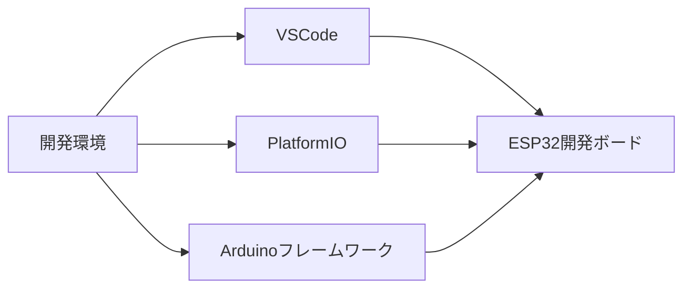

#### 必要なハードウェア
- ESP32開発ボード
- USBケーブル（Type-A to Micro-B）
- ブレッドボード
- 基本的な電子部品（LED、抵抗、センサーなど）

#### 必要なソフトウェア
- Visual Studio Code
- PlatformIO IDE拡張機能
- ESP32向けArduinoフレームワーク
- Git（バージョン管理用）

## 第1章: 組込みシステムの基礎

### 1.1 組込みシステムとは

組込みシステム（Embedded System）は、特定の機能を実現するために機器に組み込まれたコンピュータシステムです。私たちの身の回りには、スマート家電、自動車、産業機器など、様々な組込みシステムが存在します。

#### 組込みシステムの特徴

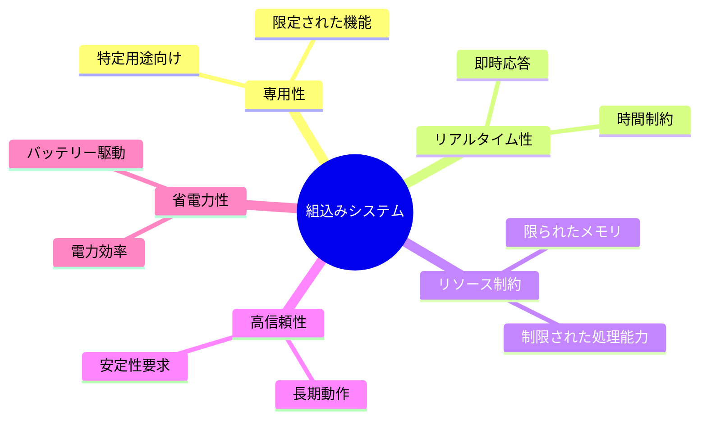

#### 組込みシステムの構成要素
1. ハードウェア
   - マイクロコントローラ（MCU）
   - メモリ（RAM/ROM）
   - 入出力インターフェース
   - センサー/アクチュエータ

2. ソフトウェア
   - ファームウェア
   - RTOS/OS
   - アプリケーション
   - デバイスドライバ

### 1.2 IoTデバイスの特徴

IoT（Internet of Things）デバイスは、従来の組込みシステムにネットワーク接続機能を追加したものです。

#### IoTデバイスの主要機能

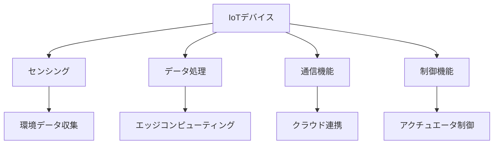

#### IoTデバイスの課題
- セキュリティ対策
- 省電力設計
- 信頼性確保
- 通信の安定性
- データ管理

### 1.3 ESP32の概要

ESP32は、Espressif Systems社が開発した高性能なSoC（System on Chip）で、IoTデバイス開発に適した機能を多数搭載しています。

#### ESP32の主要スペック
- デュアルコアCPU（最大240MHz）
- 520KB SRAM
- Wi-Fi 802.11 b/g/n
- Bluetooth 4.2/BLE
- 豊富なペリフェラル
  - GPIO
  - ADC/DAC
  - I2C/SPI/UART
  - PWM
  - タイマー

#### ESP32のブロック図

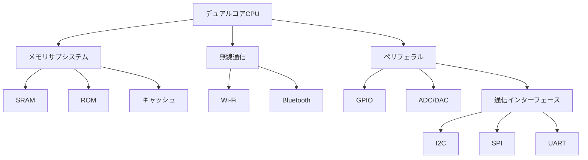

### 1.4 開発環境のセットアップ

#### VSCodeのインストールと設定
1. VSCodeのダウンロードとインストール
2. 日本語化（必要に応じて）
3. 基本設定の確認

#### PlatformIOのセットアップ
1. PlatformIO IDEの拡張機能インストール
2. ESP32開発環境の構築
3. 基本的なプロジェクト構造

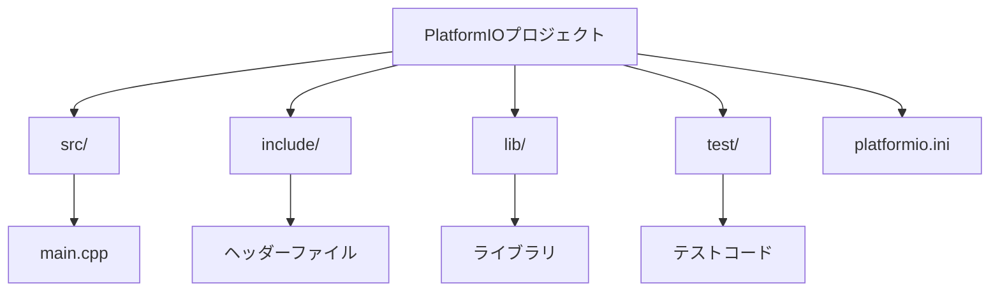

#### Arduinoフレームワークの設定
1. ESP32ボードマネージャのインストール
2. 必要なライブラリの追加
3. シリアルポートの設定

#### 動作確認
以下の簡単なLチカプログラムで開発環境の動作確認を行います：

```cpp
#include <Arduino.h>

void setup() {
    pinMode(2, OUTPUT);    // ESP32の内蔵LEDはGPIO2に接続
}

void loop() {
    digitalWrite(2, HIGH); // LED点灯
    delay(1000);          // 1秒待機
    digitalWrite(2, LOW);  // LED消灯
    delay(1000);          // 1秒待機
}
```

## 第2章: C++による組込みプログラミング基礎

組込みシステム開発におけるC++プログラミングは、一般的なアプリケーション開発とは異なる考慮点があります。本章では、組込み開発特有のC++プログラミング手法について解説します。

### 2.1 C++の基本文法

#### クラスとオブジェクト
組込み開発では、ハードウェアの抽象化にクラスを活用します：

```cpp
class LED {
private:
    uint8_t pin;
    bool state;

public:
    LED(uint8_t pin) : pin(pin), state(false) {
        pinMode(pin, OUTPUT);
    }

    void turnOn() {
        digitalWrite(pin, HIGH);
        state = true;
    }

    void turnOff() {
        digitalWrite(pin, LOW);
        state = false;
    }

    void toggle() {
        state ? turnOff() : turnOn();
    }

    bool getState() const {
        return state;
    }
};
```

#### テンプレート
汎用的なハードウェア制御クラスの実装に活用：

```cpp
template<typename T>
class Sensor {
private:
    uint8_t pin;
    T lastReading;

public:
    Sensor(uint8_t pin) : pin(pin) {}

    T read() {
        lastReading = analogRead(pin);
        return lastReading;
    }

    T getLastReading() const {
        return lastReading;
    }
};
```

### 2.2 組込み開発特有の考慮点

#### メモリ管理の最適化

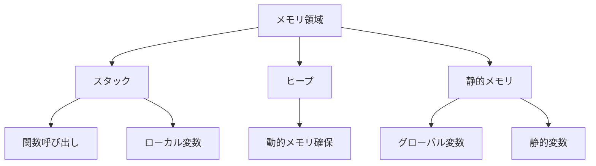

#### 最適化のベストプラクティス
1. スタック領域の効率的な使用
   ```cpp
   // 悪い例
   void badFunction() {
       char largeArray[1000];  // スタックを圧迫
   }

   // 良い例
   static char sharedBuffer[1000];  // 静的メモリに配置
   void goodFunction() {
       // 共有バッファを使用
   }
   ```

2. 動的メモリ割り当ての最小化
   ```cpp
   // 避けるべき
   String dynamicString = "sensor_" + String(sensorId);  // 動的メモリ割り当て

   // 推奨
   char staticBuffer[32];
   snprintf(staticBuffer, sizeof(staticBuffer), "sensor_%d", sensorId);
   ```

### 2.3 メモリ管理

#### メモリレイアウト

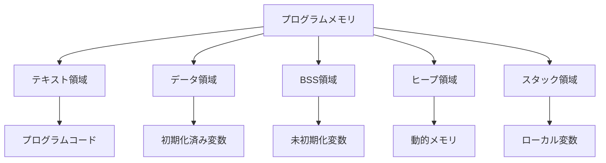

#### メモリ使用量の最適化
```cpp
// メモリ使用量を監視する関数
void printMemoryStats() {
    Serial.printf("Free Heap: %d bytes\n", ESP.getFreeHeap());
    Serial.printf("Heap Fragmentation: %d%%\n", ESP.getHeapFragmentation());
    Serial.printf("Maximum Block: %d bytes\n", ESP.getMaxAllocHeap());
}
```

### 2.4 割り込み処理

#### 割り込みの基本
割り込みは、外部イベントに即座に対応するための重要な機能です。

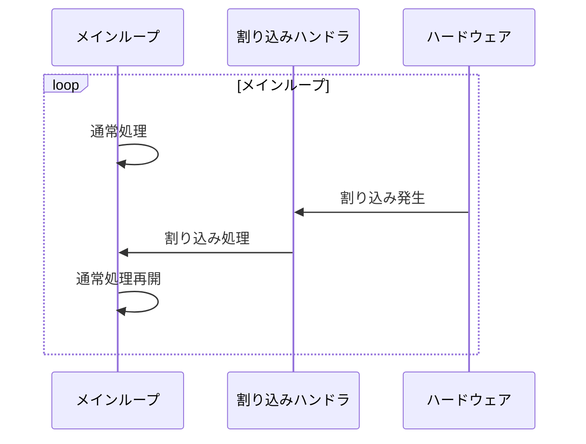

#### 割り込みハンドラの実装例
```cpp
volatile bool buttonPressed = false;
const uint8_t BUTTON_PIN = 0;

void IRAM_ATTR buttonISR() {
    buttonPressed = true;
}

void setup() {
    pinMode(BUTTON_PIN, INPUT_PULLUP);
    attachInterrupt(digitalPinToInterrupt(BUTTON_PIN), buttonISR, FALLING);
}

void loop() {
    if (buttonPressed) {
        // デバウンス処理
        static unsigned long lastDebounceTime = 0;
        unsigned long currentTime = millis();
        
        if (currentTime - lastDebounceTime > 200) {
            Serial.println("Button Pressed!");
            lastDebounceTime = currentTime;
        }
        buttonPressed = false;
    }
}
```

#### 割り込み処理の注意点
1. 割り込みハンドラは短く保つ
2. volatile修飾子の適切な使用
3. クリティカルセクションの保護
4. 再入可能性の考慮

```cpp
// クリティカルセクションの例
portMUX_TYPE mux = portMUX_INITIALIZER_UNLOCKED;
volatile int sharedVariable = 0;

void IRAM_ATTR criticalISR() {
    portENTER_CRITICAL_ISR(&mux);
    sharedVariable++;
    portEXIT_CRITICAL_ISR(&mux);
}
```

## 第3章: リアルタイムOS（RTOS）

### 3.1 RTOSの概念

リアルタイムOS（RTOS）は、タスクのスケジューリングと実行を管理し、リアルタイム性を保証するオペレーティングシステムです。

#### RTOSの特徴

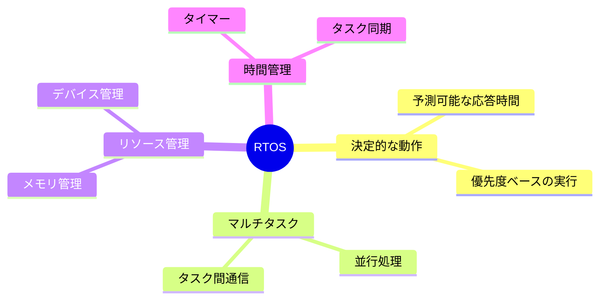

#### RTOSとベアメタルの比較
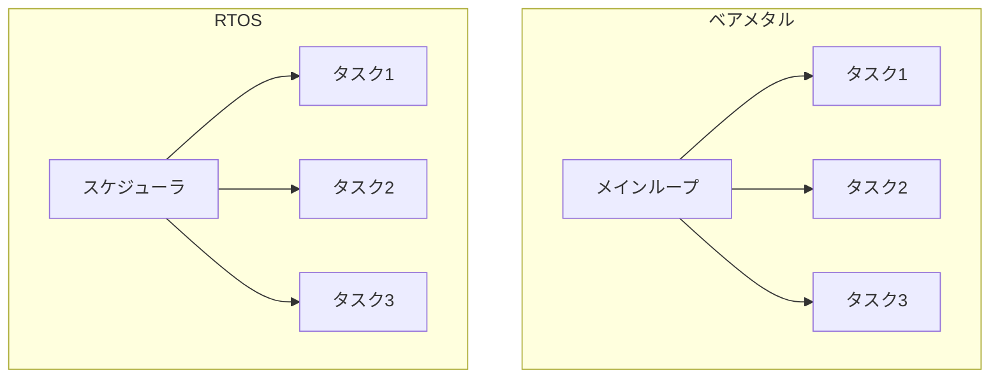

### 3.2 FreeRTOSの基礎

ESP32で使用されるFreeRTOSは、最も広く使用されているRTOSの一つです。

#### FreeRTOSの基本構成
```cpp
#include <freertos/FreeRTOS.h>
#include <freertos/task.h>

void task1(void* parameter) {
    while (true) {
        // タスク1の処理
        vTaskDelay(pdMS_TO_TICKS(1000));  // 1秒待機
    }
}

void task2(void* parameter) {
    while (true) {
        // タスク2の処理
        vTaskDelay(pdMS_TO_TICKS(500));   // 0.5秒待機
    }
}

void setup() {
    xTaskCreate(
        task1,          // タスク関数
        "Task1",        // タスク名
        2048,           // スタックサイズ
        NULL,           // パラメータ
        1,              // 優先度
        NULL           // タスクハンドル
    );
    
    xTaskCreate(task2, "Task2", 2048, NULL, 2, NULL);
}
```

### 3.3 タスク管理

#### タスクの状態遷移

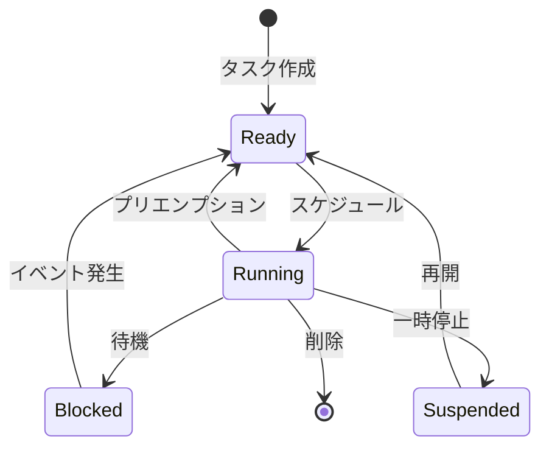

#### タスク優先度と実行制御
```cpp
// タスク優先度の設定例
void priorityExample() {
    TaskHandle_t xHandle = NULL;
    
    // 高優先度タスクの作成
    xTaskCreate(
        highPriorityTask,
        "HighPriority",
        2048,
        NULL,
        configMAX_PRIORITIES - 1,  // 最高優先度
        &xHandle
    );
    
    // タスク優先度の動的変更
    vTaskPrioritySet(xHandle, configMAX_PRIORITIES - 2);
}
```

### 3.4 セマフォとミューテックス

#### セマフォの使用例
```cpp
#include <freertos/semphr.h>

SemaphoreHandle_t xSemaphore = NULL;

void producerTask(void* parameter) {
    while (true) {
        // リソースの生成
        xSemaphoreGive(xSemaphore);  // セマフォを解放
        vTaskDelay(pdMS_TO_TICKS(1000));
    }
}

void consumerTask(void* parameter) {
    while (true) {
        if (xSemaphoreTake(xSemaphore, portMAX_DELAY) == pdTRUE) {
            // リソースの使用
        }
    }
}

void setup() {
    xSemaphore = xSemaphoreCreateBinary();
    xTaskCreate(producerTask, "Producer", 2048, NULL, 1, NULL);
    xTaskCreate(consumerTask, "Consumer", 2048, NULL, 1, NULL);
}
```

#### ミューテックスの使用例
```cpp
#include <freertos/semphr.h>

SemaphoreHandle_t xMutex = NULL;
int sharedResource = 0;

void taskWithMutex(void* parameter) {
    while (true) {
        if (xSemaphoreTake(xMutex, portMAX_DELAY) == pdTRUE) {
            // クリティカルセクション
            sharedResource++;
            xSemaphoreGive(xMutex);
        }
        vTaskDelay(pdMS_TO_TICKS(100));
    }
}
```

### 3.5 キューとメッセージパッシング

#### キューの基本使用
```cpp
#include <freertos/queue.h>

QueueHandle_t xQueue = NULL;

void senderTask(void* parameter) {
    int value = 0;
    while (true) {
        xQueueSend(xQueue, &value, portMAX_DELAY);
        value++;
        vTaskDelay(pdMS_TO_TICKS(1000));
    }
}

void receiverTask(void* parameter) {
    int receivedValue;
    while (true) {
        if (xQueueReceive(xQueue, &receivedValue, portMAX_DELAY) == pdTRUE) {
            Serial.printf("Received: %d\n", receivedValue);
        }
    }
}

void setup() {
    Serial.begin(115200);
    xQueue = xQueueCreate(10, sizeof(int));  // 10個のint型要素を格納可能
    
    xTaskCreate(senderTask, "Sender", 2048, NULL, 1, NULL);
    xTaskCreate(receiverTask, "Receiver", 2048, NULL, 1, NULL);
}
```

#### タスク通知の使用例
```cpp
void notifyingTask(void* parameter) {
    TaskHandle_t xTaskToNotify = (TaskHandle_t)parameter;
    
    while (true) {
        // タスク通知の送信
        xTaskNotify(xTaskToNotify, 0x01, eSetBits);
        vTaskDelay(pdMS_TO_TICKS(1000));
    }
}

void notifiedTask(void* parameter) {
    uint32_t ulNotificationValue;
    
    while (true) {
        // タスク通知の待機
        if (xTaskNotifyWait(0x00, 0xFFFFFFFF, &ulNotificationValue, portMAX_DELAY) == pdTRUE) {
            Serial.printf("Notification received: %lu\n", ulNotificationValue);
        }
    }
}
```

## 第4章: 組込みLinux

### 4.1 組込みLinuxの特徴

組込みLinuxは、リソースが制限された組込みシステムで動作するように最適化されたLinuxシステムです。

#### 組込みLinuxの利点と課題

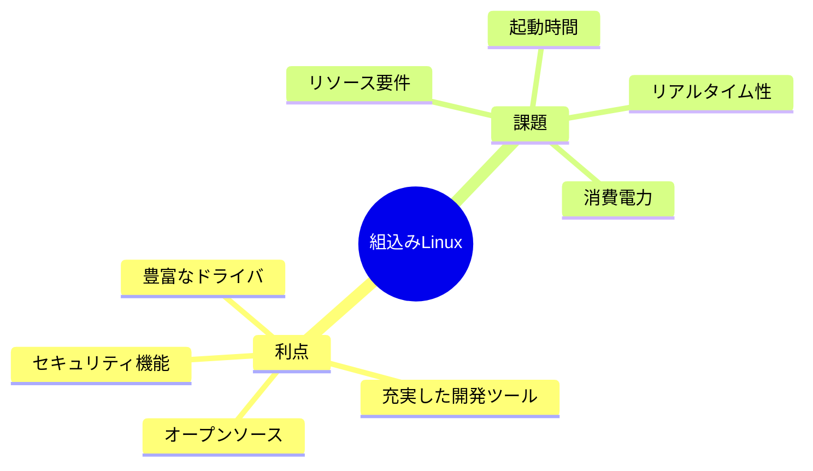

#### 組込みLinuxのアーキテクチャ

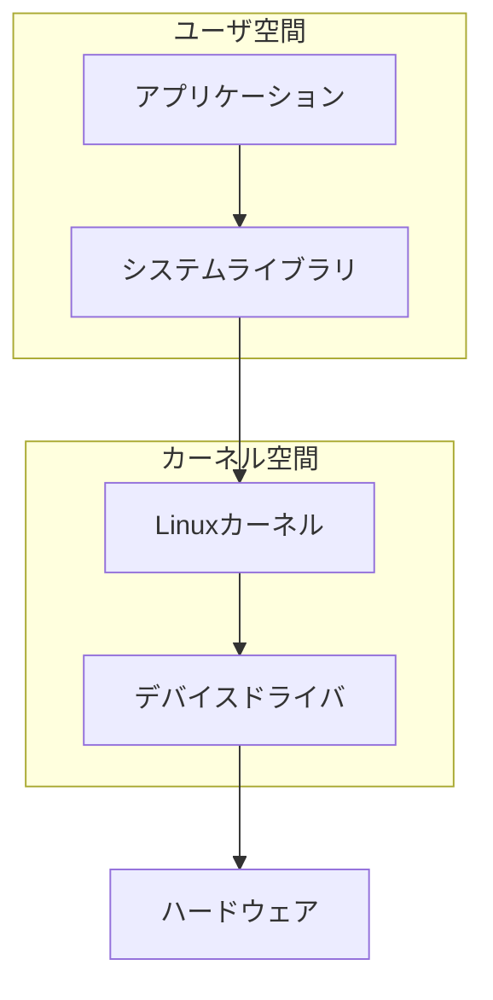

### 4.2 ブートローダー

#### U-Bootの基本
U-Bootは組込みシステムで最も広く使用されているブートローダーです。

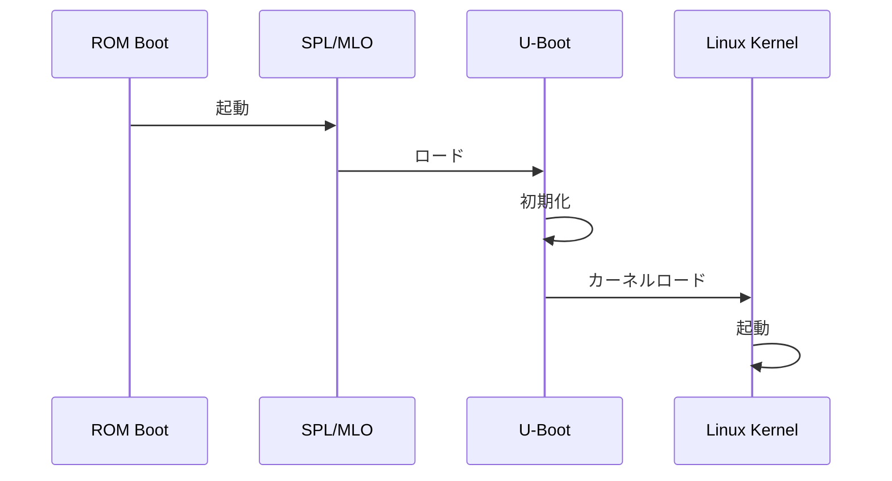

#### U-Boot設定例
```bash
# U-Boot環境変数の設定
setenv bootargs console=ttyS0,115200 root=/dev/mmcblk0p2 rw rootwait
setenv bootcmd 'fatload mmc 0:1 ${loadaddr} zImage; fatload mmc 0:1 ${fdtaddr} dtb; bootz ${loadaddr} - ${fdtaddr}'
saveenv
```

### 4.3 カーネルとデバイスドライバ

#### カーネルの設定とビルド
```bash
# カーネル設定
make menuconfig
# ビルド
make ARCH=arm CROSS_COMPILE=arm-linux-gnueabihf- zImage
```

#### デバイスドライバの例
```c
#include <linux/module.h>
#include <linux/kernel.h>
#include <linux/init.h>

// モジュール情報
MODULE_LICENSE("GPL");
MODULE_AUTHOR("Your Name");
MODULE_DESCRIPTION("Simple Linux Driver");

// デバイスドライバの初期化
static int __init simple_init(void) {
    printk(KERN_INFO "Simple driver initialized\n");
    return 0;
}

// デバイスドライバの終了
static void __exit simple_exit(void) {
    printk(KERN_INFO "Simple driver exited\n");
}

module_init(simple_init);
module_exit(simple_exit);
```

#### デバイスツリーの例
```dts
/dts-v1/;
/ {
    compatible = "vendor,board";
    model = "Example Board";

    chosen {
        bootargs = "console=ttyS0,115200";
    };

    soc {
        uart0: serial@10000000 {
            compatible = "vendor,uart";
            reg = <0x10000000 0x100>;
            interrupts = <0 1 2>;
            status = "okay";
        };
    };
};
```

### 4.4 ファイルシステム

#### ルートファイルシステムの構造

```mermaid
graph TD
    A[/] --> B[/bin]
    A --> C[/dev]
    A --> D[/etc]
    A --> E[/lib]
    A --> F[/proc]
    A --> G[/sys]
    A --> H[/usr]
    H --> I[/usr/bin]
    H --> J[/usr/lib]
```

#### ファイルシステムの種類と特徴
1. ext4
   - ジャーナリング
   - 大容量対応
   - 高信頼性

2. squashfs
   - 読み取り専用
   - 高圧縮率
   - 省メモリ

3. ubifs
   - フラッシュメモリ向け
   - ウェアレベリング
   - 電源断耐性

#### initramfsの作成例
```bash
#!/bin/bash
# initramfsの作成
mkdir -p initramfs
cd initramfs
mkdir -p bin dev etc lib proc sys

# 基本的なコマンドのコピー
cp /bin/busybox bin/
bin/busybox --install bin/

# initスクリプトの作成
cat > init << EOF
#!/bin/sh
mount -t proc proc /proc
mount -t sysfs sysfs /sys
mount -t devtmpfs devtmpfs /dev
exec /bin/sh
EOF

chmod +x init

# initramfsの作成
find . | cpio -H newc -o | gzip > ../initramfs.cpio.gz
```

#### systemdの基本設定
```ini
# /etc/systemd/system/myservice.service
[Unit]
Description=My Embedded Service
After=network.target

[Service]
Type=simple
ExecStart=/usr/bin/myservice
Restart=always

[Install]
WantedBy=multi-user.target
```

## 第5章: デバイスドライバ開発

### 5.1 デバイスドライバの基礎

#### デバイスドライバの種類

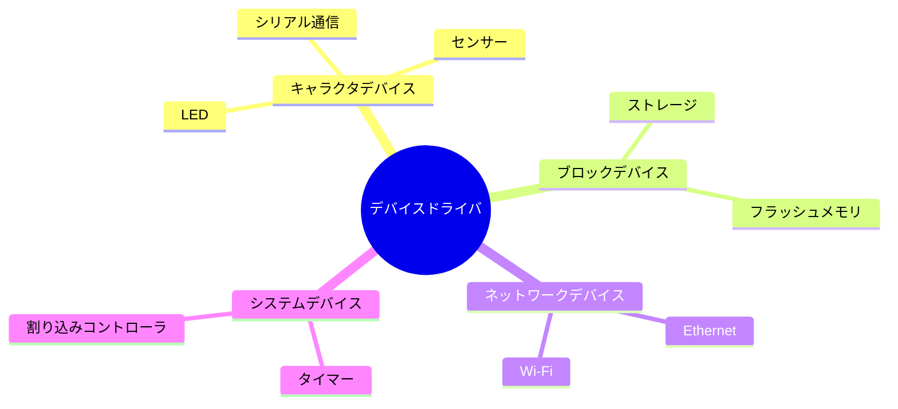

#### ドライバ開発の基本構造
```cpp
#include <driver/gpio.h>
#include <esp_log.h>

static const char* TAG = "GPIO_DRIVER";

class GPIODriver {
private:
    gpio_num_t pin;
    bool initialized;

public:
    GPIODriver(gpio_num_t pin) : pin(pin), initialized(false) {}

    esp_err_t init() {
        gpio_config_t io_conf = {};
        io_conf.pin_bit_mask = (1ULL << pin);
        io_conf.mode = GPIO_MODE_OUTPUT;
        io_conf.pull_up_en = GPIO_PULLUP_DISABLE;
        io_conf.pull_down_en = GPIO_PULLDOWN_DISABLE;
        io_conf.intr_type = GPIO_INTR_DISABLE;

        esp_err_t ret = gpio_config(&io_conf);
        if (ret == ESP_OK) {
            initialized = true;
            ESP_LOGI(TAG, "GPIO %d initialized successfully", pin);
        }
        return ret;
    }

    esp_err_t set_level(bool level) {
        if (!initialized) {
            return ESP_ERR_INVALID_STATE;
        }
        return gpio_set_level(pin, level);
    }
};
```

### 5.2 I2Cデバイスドライバ

#### I2C通信の基本

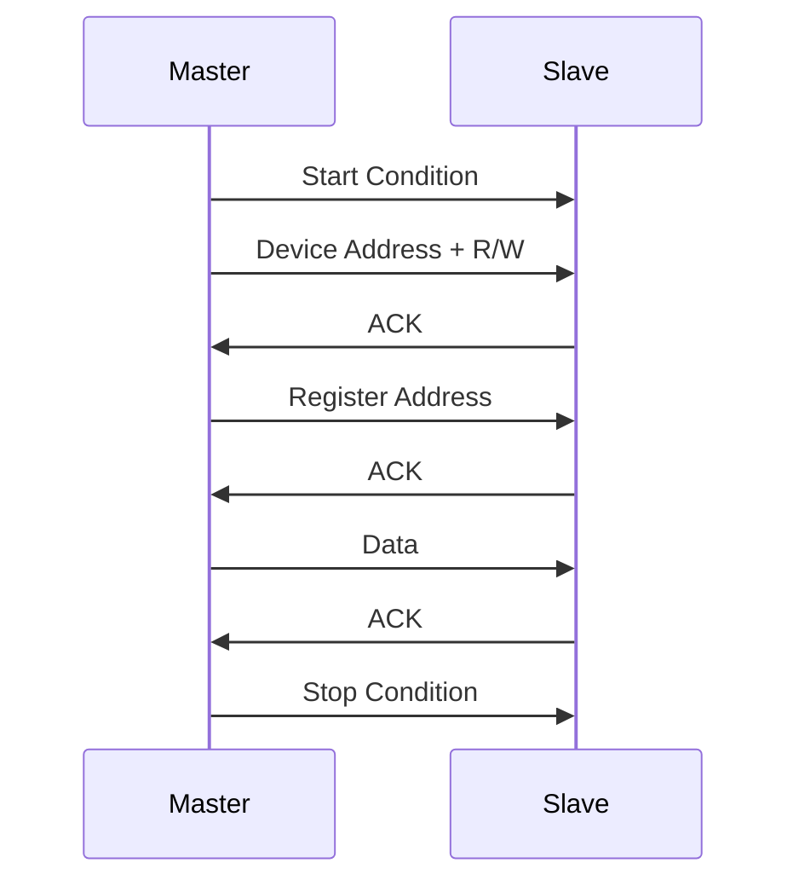

#### I2Cドライバの実装例
```cpp
#include <driver/i2c.h>
#include <esp_log.h>

class I2CDevice {
private:
    i2c_port_t port;
    uint8_t address;
    static const char* TAG;

public:
    I2CDevice(i2c_port_t port, uint8_t address) 
        : port(port), address(address) {}

    esp_err_t init(gpio_num_t sda_pin, gpio_num_t scl_pin) {
        i2c_config_t conf = {
            .mode = I2C_MODE_MASTER,
            .sda_io_num = sda_pin,
            .scl_io_num = scl_pin,
            .sda_pullup_en = GPIO_PULLUP_ENABLE,
            .scl_pullup_en = GPIO_PULLUP_ENABLE,
            .master = {
                .clk_speed = 100000
            }
        };
        
        esp_err_t ret = i2c_param_config(port, &conf);
        if (ret != ESP_OK) return ret;

        return i2c_driver_install(port, I2C_MODE_MASTER, 0, 0, 0);
    }

    esp_err_t write_reg(uint8_t reg, uint8_t data) {
        uint8_t write_buf[2] = {reg, data};
        return i2c_master_write_to_device(port, address, write_buf, 2, 
                                        pdMS_TO_TICKS(100));
    }

    esp_err_t read_reg(uint8_t reg, uint8_t* data) {
        return i2c_master_write_read_device(port, address, &reg, 1, 
                                          data, 1, pdMS_TO_TICKS(100));
    }
};

const char* I2CDevice::TAG = "I2C_DEVICE";
```

### 5.3 SPIデバイスドライバ

#### SPI通信の基本

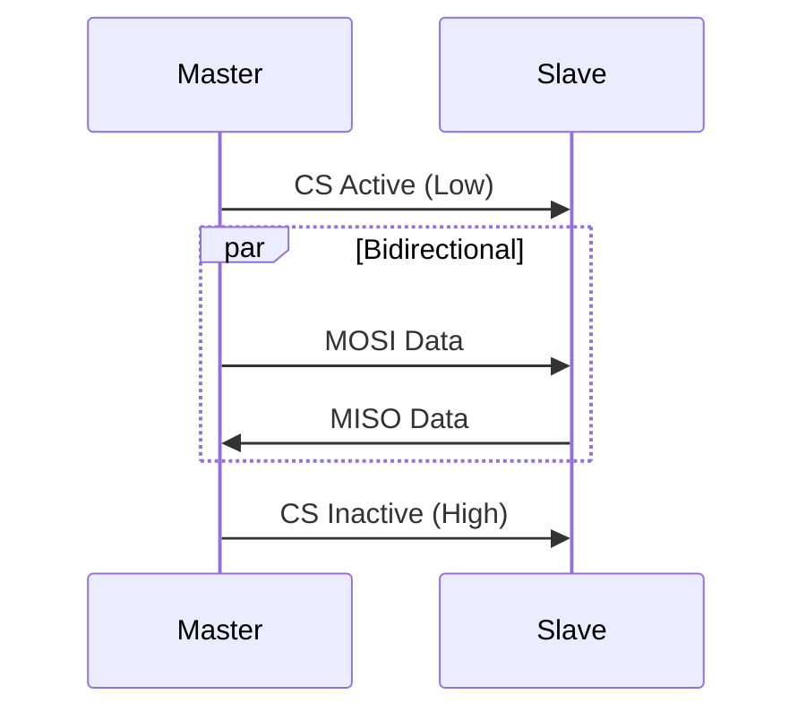

#### SPIドライバの実装例
```cpp
#include <driver/spi_master.h>
#include <esp_log.h>

class SPIDevice {
private:
    spi_device_handle_t spi;
    gpio_num_t cs_pin;
    static const char* TAG;

public:
    SPIDevice(gpio_num_t cs_pin) : cs_pin(cs_pin) {}

    esp_err_t init(spi_host_device_t host) {
        spi_device_interface_config_t dev_config = {
            .mode = 0,
            .clock_speed_hz = 1000000,
            .spics_io_num = cs_pin,
            .queue_size = 1,
        };

        return spi_bus_add_device(host, &dev_config, &spi);
    }

    esp_err_t transfer(uint8_t* tx_data, uint8_t* rx_data, size_t len) {
        spi_transaction_t t = {
            .length = len * 8,
            .tx_buffer = tx_data,
            .rx_buffer = rx_data
        };

        return spi_device_transmit(spi, &t);
    }
};

const char* SPIDevice::TAG = "SPI_DEVICE";
```

### 5.4 UARTデバイスドライバ

#### UART通信の基本

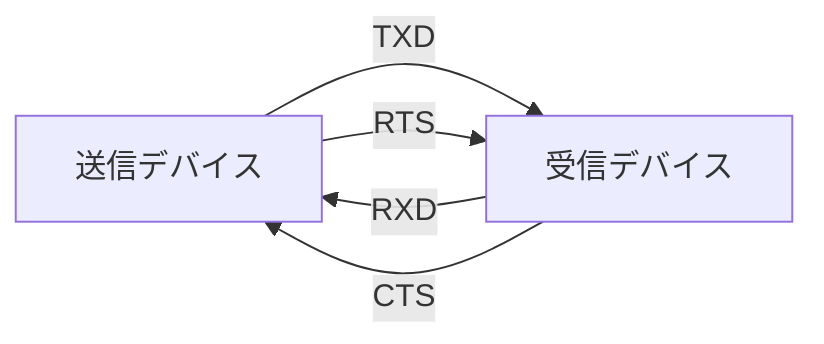

#### UARTドライバの実装例
```cpp
#include <driver/uart.h>
#include <esp_log.h>

class UARTDevice {
private:
    uart_port_t port;
    static const char* TAG;
    static const int BUF_SIZE = 1024;

public:
    UARTDevice(uart_port_t port) : port(port) {}

    esp_err_t init(int baud_rate, gpio_num_t tx_pin, gpio_num_t rx_pin) {
        uart_config_t uart_config = {
            .baud_rate = baud_rate,
            .data_bits = UART_DATA_8_BITS,
            .parity = UART_PARITY_DISABLE,
            .stop_bits = UART_STOP_BITS_1,
            .flow_ctrl = UART_HW_FLOWCTRL_DISABLE
        };

        esp_err_t ret = uart_param_config(port, &uart_config);
        if (ret != ESP_OK) return ret;

        return uart_set_pin(port, tx_pin, rx_pin, 
                          UART_PIN_NO_CHANGE, UART_PIN_NO_CHANGE);
    }

    esp_err_t write(const uint8_t* data, size_t len) {
        return uart_write_bytes(port, (const char*)data, len);
    }

    int read(uint8_t* data, size_t len, TickType_t ticks_to_wait) {
        return uart_read_bytes(port, data, len, ticks_to_wait);
    }

    void flush() {
        uart_flush(port);
    }
};

const char* UARTDevice::TAG = "UART_DEVICE";

// 使用例
void uart_example() {
    UARTDevice uart(UART_NUM_1);
    uart.init(115200, GPIO_NUM_17, GPIO_NUM_16);

    // データ送信
    const char* test_str = "Hello, UART!\n";
    uart.write((const uint8_t*)test_str, strlen(test_str));

    // データ受信
    uint8_t data[128];
    int len = uart.read(data, sizeof(data), pdMS_TO_TICKS(100));
    if (len > 0) {
        ESP_LOGI(UARTDevice::TAG, "Received %d bytes: %.*s", len, len, data);
    }
}
```

## 第6章: 低消費電力設計

### 6.1 電力管理の基礎

#### 消費電力の要因

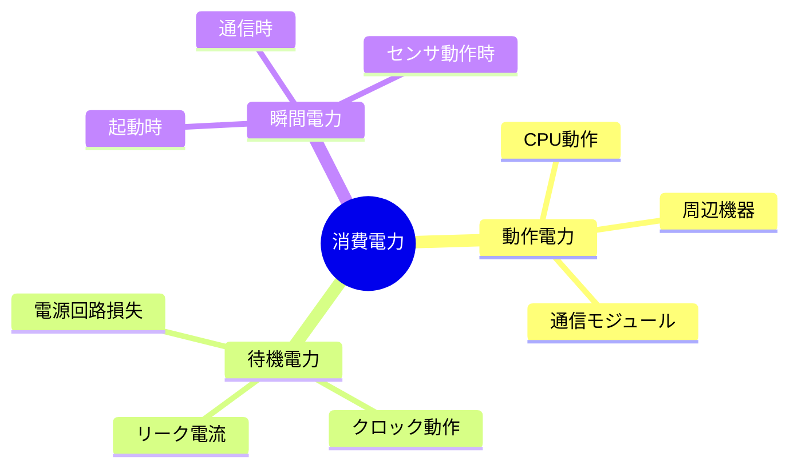

#### 消費電力の測定と分析
```cpp
#include <esp_pm.h>
#include <esp_sleep.h>
#include <driver/adc.h>

class PowerMonitor {
private:
    adc1_channel_t voltage_channel;
    adc1_channel_t current_channel;
    
public:
    PowerMonitor(adc1_channel_t v_channel, adc1_channel_t i_channel)
        : voltage_channel(v_channel), current_channel(i_channel) {
        
        // ADCの設定
        adc1_config_width(ADC_WIDTH_BIT_12);
        adc1_config_channel_atten(voltage_channel, ADC_ATTEN_DB_11);
        adc1_config_channel_atten(current_channel, ADC_ATTEN_DB_11);
    }
    
    float measurePower() {
        // 電圧と電流の測定
        float voltage = adc1_get_raw(voltage_channel) * 3.3f / 4095.0f;
        float current = adc1_get_raw(current_channel) * 3.3f / 4095.0f;
        
        return voltage * current;  // 消費電力（W）
    }
};
```

### 6.2 スリープモード

#### ESP32のスリープモード

```mermaid
graph TD
    A[Active Mode] --> B[Light Sleep]
    A --> C[Deep Sleep]
    A --> D[Hibernation]
    B --> A
    C --> A
    D --> A
    
    subgraph "消費電力"
    E[Active: ~160-260mA]
    F[Light Sleep: ~800µA]
    G[Deep Sleep: ~10µA]
    H[Hibernation: ~2.5µA]
    end
```

#### スリープモードの実装
```cpp
#include <esp_sleep.h>
#include <esp_wifi.h>

class PowerManager {
public:
    // ライトスリープモード
    static void enterLightSleep(uint32_t sleep_time_ms) {
        // Wi-Fiをスリープモードに
        esp_wifi_stop();
        
        // スリープ時間の設定
        esp_sleep_enable_timer_wakeup(sleep_time_ms * 1000);
        
        // ライトスリープ開始
        esp_light_sleep_start();
    }
    
    // ディープスリープモード
    static void enterDeepSleep(uint32_t sleep_time_ms) {
        // スリープ時間の設定
        esp_sleep_enable_timer_wakeup(sleep_time_ms * 1000);
        
        // ディープスリープ開始
        esp_deep_sleep_start();
    }
    
    // 外部割り込みによる起動設定
    static void enableWakeupPin(gpio_num_t pin) {
        esp_sleep_enable_ext0_wakeup(pin, 0);  // ピンがLowでウェイクアップ
    }
};
```

### 6.3 動的周波数制御

#### 周波数スケーリング

```mermaid
graph LR
    A[CPU周波数] --> B[240MHz]
    A --> C[160MHz]
    A --> D[80MHz]
    A --> E[40MHz]
    B -->|高性能/高消費電力| F[処理性能]
    E -->|低性能/低消費電力| F
```

#### 動的周波数制御の実装
```cpp
#include <esp_pm.h>
#include <esp_clk.h>

class FrequencyManager {
public:
    static esp_err_t configureDynamicFrequency() {
        esp_pm_config_esp32_t pm_config = {
            .max_freq_mhz = 240,  // 最大周波数
            .min_freq_mhz = 80,   // 最小周波数
            .light_sleep_enable = true
        };
        
        return esp_pm_configure(&pm_config);
    }
    
    static void setFixedFrequency(int freq_mhz) {
        esp_pm_lock_handle_t pm_lock;
        esp_pm_lock_create(ESP_PM_CPU_FREQ_MAX, 0, "CPU_LOCK", &pm_lock);
        esp_pm_lock_acquire(pm_lock);
        
        // 周波数を設定
        esp_set_cpu_freq(freq_mhz);
    }
};
```

### 6.4 電力最適化テクニック

#### 電力最適化の戦略

```mermaid
graph TB
    A[電力最適化] --> B[ハードウェア最適化]
    A --> C[ソフトウェア最適化]
    A --> D[システム設計最適化]
    
    B --> E[省電力部品選定]
    B --> F[電源回路効率化]
    
    C --> G[効率的なアルゴリズム]
    C --> H[適切なスリープ制御]
    
    D --> I[タスクスケジューリング]
    D --> J[通信プロトコル最適化]
```

#### 実装例：センサーノードの電力最適化
```cpp
#include <esp_sleep.h>
#include <driver/gpio.h>
#include <driver/adc.h>

class OptimizedSensorNode {
private:
    gpio_num_t sensor_power_pin;
    adc1_channel_t sensor_channel;
    uint32_t sampling_interval_ms;
    
public:
    OptimizedSensorNode(gpio_num_t power_pin, adc1_channel_t channel, 
                       uint32_t interval_ms)
        : sensor_power_pin(power_pin), sensor_channel(channel),
          sampling_interval_ms(interval_ms) {
        
        // センサー電源ピンの設定
        gpio_set_direction(sensor_power_pin, GPIO_MODE_OUTPUT);
        
        // ADCの設定
        adc1_config_width(ADC_WIDTH_BIT_12);
        adc1_config_channel_atten(sensor_channel, ADC_ATTEN_DB_11);
    }
    
    float readSensor() {
        // センサーの電源を入れる
        gpio_set_level(sensor_power_pin, 1);
        vTaskDelay(pdMS_TO_TICKS(10));  // 安定化待ち
        
        // 測定
        float reading = adc1_get_raw(sensor_channel) * 3.3f / 4095.0f;
        
        // センサーの電源を切る
        gpio_set_level(sensor_power_pin, 0);
        
        return reading;
    }
    
    void runMeasurementCycle() {
        while (true) {
            // センサー読み取り
            float value = readSensor();
            
            // データ送信（必要に応じて）
            sendData(value);
            
            // スリープ
            PowerManager::enterDeepSleep(sampling_interval_ms);
        }
    }
    
private:
    void sendData(float value) {
        // データ送信の実装
        // 必要最小限の時間だけ無線をオンにする
    }
};

// 使用例
void setup() {
    OptimizedSensorNode node(GPIO_NUM_5, ADC1_CHANNEL_0, 60000);  // 1分間隔
    node.runMeasurementCycle();
}
```

#### バッテリー寿命の最適化
```cpp
class BatteryMonitor {
private:
    adc1_channel_t battery_channel;
    float warning_threshold;
    float critical_threshold;
    
public:
    BatteryMonitor(adc1_channel_t channel, float warning_v, float critical_v)
        : battery_channel(channel), 
          warning_threshold(warning_v),
          critical_threshold(critical_v) {
        
        adc1_config_width(ADC_WIDTH_BIT_12);
        adc1_config_channel_atten(battery_channel, ADC_ATTEN_DB_11);
    }
    
    float getBatteryVoltage() {
        return adc1_get_raw(battery_channel) * 3.3f / 4095.0f;
    }
    
    void checkBatteryStatus() {
        float voltage = getBatteryVoltage();
        
        if (voltage < critical_threshold) {
            // クリティカル状態：最小限の機能のみ実行
            enterEmergencyMode();
        } else if (voltage < warning_threshold) {
            // 警告状態：一部機能を制限
            enterPowerSaveMode();
        }
    }
    
private:
    void enterEmergencyMode() {
        // クリティカルモードの実装
        // - 測定間隔を長くする
        // - 通信を最小限にする
        // - 不要な機能を無効化
    }
    
    void enterPowerSaveMode() {
        // 省電力モードの実装
        // - CPU周波数を下げる
        // - 通信間隔を調整
        // - 非重要な機能を制限
    }
};
```

## 第7章: センサーとアクチュエータの制御

### 7.1 各種センサーの基礎

#### センサーの種類と特徴

```mermaid
mindmap
  root((センサー))
    環境センサー
      温度
      湿度
      気圧
      照度
    モーションセンサー
      加速度
      ジャイロ
      地磁気
    位置センサー
      GPS
      近接センサー
    化学センサー
      ガス
      pH
```

#### センサーインターフェースの抽象化
```cpp
#include <driver/i2c.h>
#include <driver/spi.h>
#include <driver/adc.h>

// センサーインターフェースの基底クラス
class SensorInterface {
public:
    virtual ~SensorInterface() = default;
    virtual bool init() = 0;
    virtual float readValue() = 0;
    virtual void calibrate() = 0;
};

// I2Cセンサーの実装
class I2CSensor : public SensorInterface {
private:
    i2c_port_t port;
    uint8_t address;
    
public:
    I2CSensor(i2c_port_t port, uint8_t addr) : port(port), address(addr) {}
    
    bool init() override {
        // I2Cの初期化処理
        return true;
    }
    
    float readValue() override {
        uint8_t data[2];
        i2c_cmd_handle_t cmd = i2c_cmd_link_create();
        i2c_master_start(cmd);
        i2c_master_write_byte(cmd, (address << 1) | I2C_MASTER_READ, true);
        i2c_master_read(cmd, data, 2, I2C_MASTER_LAST_NACK);
        i2c_master_stop(cmd);
        i2c_master_cmd_begin(port, cmd, pdMS_TO_TICKS(100));
        i2c_cmd_link_delete(cmd);
        
        return (data[0] << 8 | data[1]) / 100.0f;
    }
    
    void calibrate() override {
        // キャリブレーション処理
    }
};
```

### 7.2 アナログ信号処理

#### ADC（アナログ-デジタル変換）の使用

```mermaid
graph LR
    A[アナログ信号] --> B[アンチエイリアシング<br>フィルタ]
    B --> C[サンプル&<br>ホールド]
    C --> D[ADC]
    D --> E[デジタル値]
```

#### ADC制御の実装
```cpp
#include <driver/adc.h>
#include <esp_adc_cal.h>

class AnalogSensor {
private:
    adc1_channel_t channel;
    esp_adc_cal_characteristics_t adc_chars;
    
public:
    AnalogSensor(adc1_channel_t ch) : channel(ch) {
        // ADCの初期化
        adc1_config_width(ADC_WIDTH_BIT_12);
        adc1_config_channel_atten(channel, ADC_ATTEN_DB_11);
        
        // キャリブレーション
        esp_adc_cal_characterize(ADC_UNIT_1, ADC_ATTEN_DB_11, 
                               ADC_WIDTH_BIT_12, 1100, &adc_chars);
    }
    
    uint32_t readRaw() {
        return adc1_get_raw(channel);
    }
    
    uint32_t readVoltage() {
        uint32_t raw = readRaw();
        return esp_adc_cal_raw_to_voltage(raw, &adc_chars);
    }
    
    float readAverage(int samples = 10) {
        uint32_t sum = 0;
        for (int i = 0; i < samples; i++) {
            sum += readRaw();
            vTaskDelay(pdMS_TO_TICKS(10));
        }
        return sum / (float)samples;
    }
};
```

### 7.3 デジタル信号処理

#### デジタルフィルタの実装

```mermaid
graph TB
    A[入力信号] --> B[移動平均フィルタ]
    A --> C[メディアンフィルタ]
    A --> D[カルマンフィルタ]
    B --> E[ノイズ除去済み信号]
    C --> E
    D --> E
```

#### フィルタクラスの実装
```cpp
#include <vector>
#include <algorithm>

template<typename T>
class DigitalFilter {
public:
    // 移動平均フィルタ
    class MovingAverage {
    private:
        std::vector<T> buffer;
        size_t windowSize;
        size_t index;
        T sum;
        
    public:
        MovingAverage(size_t size) : windowSize(size), index(0), sum(0) {
            buffer.resize(size, 0);
        }
        
        T process(T input) {
            sum -= buffer[index];
            buffer[index] = input;
            sum += input;
            
            index = (index + 1) % windowSize;
            return sum / windowSize;
        }
    };
    
    // メディアンフィルタ
    class MedianFilter {
    private:
        std::vector<T> buffer;
        size_t windowSize;
        size_t index;
        
    public:
        MedianFilter(size_t size) : windowSize(size), index(0) {
            buffer.resize(size, 0);
        }
        
        T process(T input) {
            buffer[index] = input;
            index = (index + 1) % windowSize;
            
            std::vector<T> sorted = buffer;
            std::sort(sorted.begin(), sorted.end());
            return sorted[windowSize / 2];
        }
    };
};
```

### 7.4 PWM制御

#### PWM信号の基本

```mermaid
graph TB
    subgraph PWM信号
    A[デューティ比 25%]
    B[デューティ比 50%]
    C[デューティ比 75%]
    end
    
    A --> D[平均電圧 25%]
    B --> E[平均電圧 50%]
    C --> F[平均電圧 75%]
```

#### PWM制御の実装
```cpp
#include <driver/ledc.h>

class PWMController {
private:
    ledc_channel_t channel;
    ledc_timer_t timer;
    uint32_t frequency;
    uint8_t resolution_bits;
    
public:
    PWMController(ledc_channel_t ch, ledc_timer_t tim, 
                 uint32_t freq, uint8_t res_bits)
        : channel(ch), timer(tim), 
          frequency(freq), resolution_bits(res_bits) {}
    
    bool init(gpio_num_t pin) {
        // タイマーの設定
        ledc_timer_config_t timer_conf = {
            .speed_mode = LEDC_HIGH_SPEED_MODE,
            .duty_resolution = static_cast<ledc_timer_bit_t>(resolution_bits),
            .timer_num = timer,
            .freq_hz = frequency
        };
        
        if (ledc_timer_config(&timer_conf) != ESP_OK) {
            return false;
        }
        
        // チャネルの設定
        ledc_channel_config_t channel_conf = {
            .gpio_num = pin,
            .speed_mode = LEDC_HIGH_SPEED_MODE,
            .channel = channel,
            .timer_sel = timer,
            .duty = 0,
            .hpoint = 0
        };
        
        return ledc_channel_config(&channel_conf) == ESP_OK;
    }
    
    void setDuty(uint32_t duty_percent) {
        uint32_t max_duty = (1 << resolution_bits) - 1;
        uint32_t duty = (duty_percent * max_duty) / 100;
        ledc_set_duty(LEDC_HIGH_SPEED_MODE, channel, duty);
        ledc_update_duty(LEDC_HIGH_SPEED_MODE, channel);
    }
    
    void setFrequency(uint32_t freq_hz) {
        frequency = freq_hz;
        ledc_set_freq(LEDC_HIGH_SPEED_MODE, timer, freq_hz);
    }
};

// 使用例：LEDの明るさ制御
void pwm_example() {
    PWMController led_controller(LEDC_CHANNEL_0, LEDC_TIMER_0, 5000, 8);
    led_controller.init(GPIO_NUM_2);
    
    // 明るさを徐々に変化
    for (int i = 0; i <= 100; i += 5) {
        led_controller.setDuty(i);
        vTaskDelay(pdMS_TO_TICKS(100));
    }
}
```

## 第8章: 無線通信

### 8.1 Wi-Fi通信

#### Wi-Fi接続の基本

```mermaid
sequenceDiagram
    participant Device as ESP32
    participant AP as アクセスポイント
    participant Server as サーバー
    
    Device->>AP: スキャン
    AP-->>Device: AP一覧
    Device->>AP: 接続要求
    AP-->>Device: 認証要求
    Device->>AP: 認証情報
    AP-->>Device: 接続確立
    Device->>Server: データ通信開始
```

#### Wi-Fi接続の実装
```cpp
#include <WiFi.h>
#include <esp_wifi.h>

class WiFiManager {
private:
    const char* ssid;
    const char* password;
    static const char* TAG;
    
public:
    WiFiManager(const char* ssid, const char* password)
        : ssid(ssid), password(password) {}
    
    bool connect() {
        WiFi.mode(WIFI_STA);
        WiFi.begin(ssid, password);
        
        // 接続待機
        int attempts = 0;
        while (WiFi.status() != WL_CONNECTED && attempts < 20) {
            delay(500);
            ESP_LOGI(TAG, "Connecting to WiFi... (%d/20)", attempts + 1);
            attempts++;
        }
        
        if (WiFi.status() == WL_CONNECTED) {
            ESP_LOGI(TAG, "Connected to WiFi");
            ESP_LOGI(TAG, "IP: %s", WiFi.localIP().toString().c_str());
            return true;
        }
        
        ESP_LOGE(TAG, "Failed to connect to WiFi");
        return false;
    }
    
    void disconnect() {
        WiFi.disconnect(true);
        WiFi.mode(WIFI_OFF);
    }
    
    bool isConnected() {
        return WiFi.status() == WL_CONNECTED;
    }
    
    void setLowPower() {
        // 省電力設定
        esp_wifi_set_ps(WIFI_PS_MAX_MODEM);
    }
};

const char* WiFiManager::TAG = "WiFiManager";
```

### 8.2 Bluetooth通信

#### BLE（Bluetooth Low Energy）の基本

```mermaid
graph TB
    subgraph BLEデバイス
    A[GAP] --> B[GATT]
    B --> C[Service]
    C --> D[Characteristic]
    D --> E[Descriptor]
    end
    
    subgraph プロファイル
    F[デバイス情報]
    G[センサーデータ]
    H[制御コマンド]
    end
```

#### BLEサーバーの実装
```cpp
#include <BLEDevice.h>
#include <BLEServer.h>
#include <BLEUtils.h>
#include <BLE2902.h>

class BLEManager {
private:
    BLEServer* server;
    BLEService* service;
    BLECharacteristic* characteristic;
    bool deviceConnected;
    
    // サービスとキャラクタリスティックのUUID
    static const BLEUUID SERVICE_UUID;
    static const BLEUUID CHAR_UUID;
    
public:
    class ServerCallbacks : public BLEServerCallbacks {
        void onConnect(BLEServer* pServer) override {
            deviceConnected = true;
        }
        
        void onDisconnect(BLEServer* pServer) override {
            deviceConnected = false;
        }
    };
    
    BLEManager() : deviceConnected(false) {
        // BLEデバイスの初期化
        BLEDevice::init("ESP32 BLE Device");
        
        // サーバーの作成
        server = BLEDevice::createServer();
        server->setCallbacks(new ServerCallbacks());
        
        // サービスの作成
        service = server->createService(SERVICE_UUID);
        
        // キャラクタリスティックの作成
        characteristic = service->createCharacteristic(
            CHAR_UUID,
            BLECharacteristic::PROPERTY_READ |
            BLECharacteristic::PROPERTY_WRITE |
            BLECharacteristic::PROPERTY_NOTIFY
        );
        
        // ディスクリプタの追加
        characteristic->addDescriptor(new BLE2902());
    }
    
    void start() {
        // サービスの開始
        service->start();
        
        // アドバタイジングの開始
        BLEAdvertising* advertising = server->getAdvertising();
        advertising->addServiceUUID(SERVICE_UUID);
        advertising->start();
    }
    
    void sendData(const uint8_t* data, size_t length) {
        if (deviceConnected) {
            characteristic->setValue((uint8_t*)data, length);
            characteristic->notify();
        }
    }
};

// UUIDの定義
const BLEUUID BLEManager::SERVICE_UUID("91bad492-b950-4226-aa2b-4ede9fa42f59");
const BLEUUID BLEManager::CHAR_UUID("cba1d466-344c-4be3-ab3f-189f80dd7518");
```

### 8.3 プロトコル設計

#### カスタムプロトコルの実装

```mermaid
sequenceDiagram
    participant Client
    participant Server
    
    Note over Client,Server: コマンドフォーマット
    Note right of Client: Header (1byte) | Length (2bytes) | Payload | CRC (2bytes)
    
    Client->>Server: COMMAND_HELLO
    Server-->>Client: RESPONSE_OK
    Client->>Server: COMMAND_DATA
    Server-->>Client: RESPONSE_DATA_RECEIVED
```

#### プロトコル実装例
```cpp
#include <cstdint>
#include <vector>
#include <cstring>

class Protocol {
public:
    // コマンド定義
    enum Command : uint8_t {
        CMD_HELLO = 0x01,
        CMD_DATA = 0x02,
        CMD_ACK = 0x03,
        CMD_NACK = 0x04
    };
    
    // パケット構造体
    struct Packet {
        uint8_t header;
        uint16_t length;
        std::vector<uint8_t> payload;
        uint16_t crc;
        
        std::vector<uint8_t> serialize() const {
            std::vector<uint8_t> data;
            data.push_back(header);
            data.push_back(length & 0xFF);
            data.push_back((length >> 8) & 0xFF);
            data.insert(data.end(), payload.begin(), payload.end());
            data.push_back(crc & 0xFF);
            data.push_back((crc >> 8) & 0xFF);
            return data;
        }
        
        static Packet deserialize(const std::vector<uint8_t>& data) {
            Packet packet;
            if (data.size() < 5) return packet;  // 最小パケットサイズ
            
            packet.header = data[0];
            packet.length = data[1] | (data[2] << 8);
            packet.payload.assign(data.begin() + 3, 
                                data.end() - 2);
            packet.crc = data[data.size() - 2] | 
                        (data[data.size() - 1] << 8);
            return packet;
        }
    };
    
    // CRC16の計算
    static uint16_t calculateCRC(const std::vector<uint8_t>& data) {
        uint16_t crc = 0xFFFF;
        for (uint8_t byte : data) {
            crc ^= byte;
            for (int i = 0; i < 8; i++) {
                if (crc & 0x0001) {
                    crc = (crc >> 1) ^ 0xA001;
                } else {
                    crc = crc >> 1;
                }
            }
        }
        return crc;
    }
};
```

### 8.4 セキュリティ考慮点

#### セキュリティ対策の実装

```mermaid
graph TB
    A[セキュリティ対策] --> B[通信の暗号化]
    A --> C[認証]
    A --> D[アクセス制御]
    A --> E[ファームウェア保護]
    
    B --> F[TLS/SSL]
    B --> G[AES暗号化]
    
    C --> H[証明書認証]
    C --> I[トークン認証]
    
    D --> J[ACL]
    D --> K[ファイアウォール]
    
    E --> L[セキュアブート]
    E --> M[コード署名]
```

#### セキュア通信の実装例
```cpp
#include <WiFiClientSecure.h>
#include <mbedtls/aes.h>

class SecureCommunication {
private:
    WiFiClientSecure client;
    mbedtls_aes_context aes;
    uint8_t key[32];  // AES-256用
    
public:
    SecureCommunication() {
        mbedtls_aes_init(&aes);
    }
    
    ~SecureCommunication() {
        mbedtls_aes_free(&aes);
    }
    
    bool setupTLS(const char* cert) {
        client.setCACert(cert);
        return true;
    }
    
    bool setEncryptionKey(const uint8_t* new_key, size_t length) {
        if (length != 32) return false;
        memcpy(key, new_key, 32);
        mbedtls_aes_setkey_enc(&aes, key, 256);
        return true;
    }
    
    std::vector<uint8_t> encrypt(const std::vector<uint8_t>& data) {
        // パディング
        size_t padded_size = (data.size() + 15) & ~15;
        std::vector<uint8_t> padded_data(padded_size, 0);
        memcpy(padded_data.data(), data.data(), data.size());
        
        // 暗号化
        std::vector<uint8_t> encrypted(padded_size);
        for (size_t i = 0; i < padded_size; i += 16) {
            mbedtls_aes_crypt_ecb(&aes, MBEDTLS_AES_ENCRYPT,
                                 &padded_data[i], &encrypted[i]);
        }
        
        return encrypted;
    }
    
    bool sendSecureData(const char* server, int port, 
                       const std::vector<uint8_t>& data) {
        if (!client.connect(server, port)) {
            return false;
        }
        
        // データの暗号化
        auto encrypted = encrypt(data);
        
        // 暗号化データの送信
        client.write(encrypted.data(), encrypted.size());
        client.stop();
        
        return true;
    }
};
```

## 第9章: IoTクラウド連携

### 9.1 クラウドプラットフォーム概要

#### 主要なIoTクラウドプラットフォーム

```mermaid
mindmap
  root((IoTクラウド))
    AWS IoT
      デバイス管理
      セキュリティ
      データ分析
    Azure IoT
      IoT Hub
      Digital Twins
      Edge Computing
    Google Cloud IoT
      IoT Core
      Pub/Sub
      BigQuery
    独自プラットフォーム
      カスタム実装
      スケーラビリティ
      コスト最適化
```

#### クラウド連携アーキテクチャ
```mermaid
graph TB
    A[IoTデバイス] --> B[エッジゲートウェイ]
    A --> C[クラウドプラットフォーム]
    B --> C
    
    C --> D[データストレージ]
    C --> E[分析エンジン]
    C --> F[可視化ダッシュボード]
    
    subgraph クラウドサービス
    D
    E
    F
    end
```

### 9.2 MQTT通信

#### MQTTプロトコルの基本

```mermaid
sequenceDiagram
    participant Client as IoTデバイス
    participant Broker as MQTTブローカー
    participant Subscriber as サブスクライバー
    
    Client->>Broker: CONNECT
    Broker-->>Client: CONNACK
    Client->>Broker: PUBLISH (topic/data)
    Broker->>Subscriber: PUBLISH (topic/data)
    Subscriber-->>Broker: PUBACK
    Client->>Broker: SUBSCRIBE (topic/command)
    Broker-->>Client: SUBACK
```

#### MQTT実装例
```cpp
#include <PubSubClient.h>
#include <WiFi.h>

class MQTTClient {
private:
    WiFiClient espClient;
    PubSubClient client;
    const char* mqtt_server;
    const char* client_id;
    const char* username;
    const char* password;
    
    static void callback(char* topic, byte* payload, unsigned int length) {
        // メッセージ受信コールバック
        String message;
        for (int i = 0; i < length; i++) {
            message += (char)payload[i];
        }
        ESP_LOGI("MQTT", "Message arrived [%s]: %s", topic, message.c_str());
    }
    
public:
    MQTTClient(const char* server, const char* id, 
               const char* user, const char* pass)
        : mqtt_server(server), client_id(id),
          username(user), password(pass),
          client(espClient) {
        
        client.setServer(mqtt_server, 1883);
        client.setCallback(callback);
    }
    
    bool connect() {
        if (client.connected()) return true;
        
        ESP_LOGI("MQTT", "Attempting MQTT connection...");
        if (client.connect(client_id, username, password)) {
            ESP_LOGI("MQTT", "Connected");
            return true;
        }
        
        ESP_LOGE("MQTT", "Failed, rc=%d", client.state());
        return false;
    }
    
    bool publish(const char* topic, const char* message) {
        if (!connect()) return false;
        return client.publish(topic, message);
    }
    
    bool subscribe(const char* topic) {
        if (!connect()) return false;
        return client.subscribe(topic);
    }
    
    void loop() {
        if (!client.connected()) {
            connect();
        }
        client.loop();
    }
};
```

### 9.3 RESTful API

#### REST APIの基本設計

```mermaid
graph LR
    A[IoTデバイス] -->|POST| B[/data]
    A -->|GET| C[/config]
    A -->|PUT| D[/status]
    
    B --> E[データ保存]
    C --> F[設定取得]
    D --> G[状態更新]
```

#### HTTPクライアントの実装
```cpp
#include <HTTPClient.h>
#include <ArduinoJson.h>

class RESTClient {
private:
    const char* base_url;
    const char* api_key;
    
public:
    RESTClient(const char* url, const char* key)
        : base_url(url), api_key(key) {}
    
    bool sendData(const char* endpoint, const JsonDocument& data) {
        HTTPClient http;
        String url = String(base_url) + endpoint;
        
        http.begin(url);
        http.addHeader("Content-Type", "application/json");
        http.addHeader("X-API-Key", api_key);
        
        String json;
        serializeJson(data, json);
        
        int httpCode = http.POST(json);
        bool success = (httpCode == HTTP_CODE_OK);
        
        http.end();
        return success;
    }
    
    bool getData(const char* endpoint, JsonDocument& response) {
        HTTPClient http;
        String url = String(base_url) + endpoint;
        
        http.begin(url);
        http.addHeader("X-API-Key", api_key);
        
        int httpCode = http.GET();
        bool success = false;
        
        if (httpCode == HTTP_CODE_OK) {
            String payload = http.getString();
            DeserializationError error = deserializeJson(response, payload);
            success = !error;
        }
        
        http.end();
        return success;
    }
};
```

### 9.4 データ収集と分析

#### データ収集システムの設計

```mermaid
graph TB
    A[センサーデータ] --> B[前処理]
    B --> C[一時保存]
    C --> D[バッチ送信]
    D --> E[クラウドストレージ]
    E --> F[データ分析]
    F --> G[可視化]
    
    subgraph エッジ処理
    A
    B
    C
    D
    end
    
    subgraph クラウド処理
    E
    F
    G
    end
```

#### データ収集と分析の実装
```cpp
#include <vector>
#include <CircularBuffer.h>
#include <ArduinoJson.h>

class DataCollector {
private:
    struct SensorData {
        uint32_t timestamp;
        float value;
        uint8_t sensor_id;
    };
    
    CircularBuffer<SensorData, 100> buffer;
    std::vector<SensorData> batch_buffer;
    uint32_t last_send_time;
    uint32_t send_interval;
    RESTClient& rest_client;
    
public:
    DataCollector(RESTClient& client, uint32_t interval = 60000)
        : rest_client(client), send_interval(interval),
          last_send_time(0) {}
    
    void addMeasurement(float value, uint8_t sensor_id) {
        SensorData data = {
            .timestamp = millis(),
            .value = value,
            .sensor_id = sensor_id
        };
        
        buffer.push(data);
        
        // バッファが一定量たまったら送信
        if (buffer.size() >= 50) {
            sendBatch();
        }
    }
    
    void update() {
        uint32_t current_time = millis();
        if (current_time - last_send_time >= send_interval) {
            sendBatch();
            last_send_time = current_time;
        }
    }
    
private:
    void sendBatch() {
        if (buffer.isEmpty()) return;
        
        // JSONドキュメントの準備
        DynamicJsonDocument doc(4096);
        JsonArray data_array = doc.createNestedArray("data");
        
        // バッファからデータを取り出してJSONに変換
        while (!buffer.isEmpty()) {
            SensorData data = buffer.shift();
            JsonObject data_obj = data_array.createNestedObject();
            data_obj["timestamp"] = data.timestamp;
            data_obj["value"] = data.value;
            data_obj["sensor_id"] = data.sensor_id;
        }
        
        // データ送信
        rest_client.sendData("/measurements", doc);
    }
};

// 使用例
void data_collection_example() {
    RESTClient rest("https://api.example.com", "your-api-key");
    DataCollector collector(rest);
    
    // センサーデータの収集
    float temperature = readTemperature();
    collector.addMeasurement(temperature, 1);
    
    // 定期的な更新処理
    collector.update();
}
``` 

## 第10章: デバッグとテスト

### 10.1 デバッグ手法

#### デバッグツールとテクニック

```mermaid
mindmap
  root((デバッグ手法))
    ハードウェアデバッグ
      JTAG
      SWD
      ロジックアナライザ
    ソフトウェアデバッグ
      GDB
      ログ出力
      アサーション
    リアルタイムデバッグ
      トレース
      プロファイリング
```

#### デバッグ用ログシステムの実装
```cpp
#include <esp_log.h>
#include <freertos/FreeRTOS.h>
#include <freertos/task.h>

class DebugLogger {
private:
    static const char* TAG;
    bool debug_enabled;
    
public:
    enum LogLevel {
        ERROR = ESP_LOG_ERROR,
        WARN = ESP_LOG_WARN,
        INFO = ESP_LOG_INFO,
        DEBUG = ESP_LOG_DEBUG,
        VERBOSE = ESP_LOG_VERBOSE
    };
    
    DebugLogger(bool enable_debug = true) : debug_enabled(enable_debug) {
        esp_log_level_set(TAG, enable_debug ? ESP_LOG_DEBUG : ESP_LOG_INFO);
    }
    
    void log(LogLevel level, const char* format, ...) {
        if (!debug_enabled && level >= DEBUG) return;
        
        va_list args;
        va_start(args, format);
        esp_log_write(level, TAG, format, args);
        va_end(args);
    }
    
    void dumpMemory(const void* addr, size_t len) {
        if (!debug_enabled) return;
        
        const uint8_t* data = static_cast<const uint8_t*>(addr);
        for (size_t i = 0; i < len; i += 16) {
            ESP_LOGI(TAG, "%04x: ", i);
            for (size_t j = 0; j < 16 && i + j < len; j++) {
                ESP_LOGI(TAG, "%02x ", data[i + j]);
            }
            ESP_LOGI(TAG, "\n");
        }
    }
    
    void taskInfo() {
        char* task_list = (char*)malloc(2048);
        if (task_list) {
            vTaskList(task_list);
            ESP_LOGI(TAG, "Task List:\n%s", task_list);
            free(task_list);
        }
    }
};

const char* DebugLogger::TAG = "DEBUG";
```

### 10.2 ユニットテスト

```mermaid
graph TB
    A[テストケース] --> B[テスト実行]
    B --> C[結果検証]
    C --> D[レポート生成]
    
    subgraph テストフレームワーク
    E[セットアップ]
    F[テスト実行]
    G[クリーンアップ]
    end
```

#### ユニットテストの実装例
```cpp
#include <unity.h>

class TestFramework {
private:
    const char* test_name;
    
public:
    TestFramework(const char* name) : test_name(name) {
        UNITY_BEGIN();
        ESP_LOGI("TEST", "Starting test suite: %s", name);
    }
    
    ~TestFramework() {
        UNITY_END();
    }
    
    template<typename T>
    void assertEqual(T expected, T actual, const char* message) {
        TEST_ASSERT_EQUAL(expected, actual);
        ESP_LOGI("TEST", "%s: %s", message, 
                 expected == actual ? "PASS" : "FAIL");
    }
    
    void assertTrue(bool condition, const char* message) {
        TEST_ASSERT_TRUE(condition);
        ESP_LOGI("TEST", "%s: %s", message, 
                 condition ? "PASS" : "FAIL");
    }
};

// テスト例
void test_gpio() {
    TestFramework test("GPIO Tests");
    
    // GPIOピンのテスト
    gpio_config_t io_conf = {};
    io_conf.pin_bit_mask = (1ULL << GPIO_NUM_2);
    io_conf.mode = GPIO_MODE_OUTPUT;
    gpio_config(&io_conf);
    
    // 出力テスト
    gpio_set_level(GPIO_NUM_2, 1);
    test.assertEqual(gpio_get_level(GPIO_NUM_2), 1, "GPIO High Test");
    
    gpio_set_level(GPIO_NUM_2, 0);
    test.assertEqual(gpio_get_level(GPIO_NUM_2), 0, "GPIO Low Test");
}
```

### 10.3 統合テスト

#### 統合テストの設計

```mermaid
graph TB
    A[ユニットテスト] --> D[統合テスト]
    B[モジュールテスト] --> D
    C[インターフェーステスト] --> D
    D --> E[システムテスト]
    
    subgraph テストレベル
    A
    B
    C
    D
    E
    end
```

#### 統合テストの実装例
```cpp
class IntegrationTest {
private:
    WiFiManager wifi;
    MQTTClient mqtt;
    SensorInterface& sensor;
    
public:
    IntegrationTest(SensorInterface& s) : sensor(s) {}
    
    bool testEndToEnd() {
        // Wi-Fi接続テスト
        if (!wifi.connect()) {
            ESP_LOGE("TEST", "Wi-Fi connection failed");
            return false;
        }
        
        // MQTTブローカー接続テスト
        if (!mqtt.connect()) {
            ESP_LOGE("TEST", "MQTT connection failed");
            return false;
        }
        
        // センサー読み取りテスト
        float value = sensor.readValue();
        if (value < 0) {
            ESP_LOGE("TEST", "Sensor reading failed");
            return false;
        }
        
        // データ送信テスト
        char data[32];
        snprintf(data, sizeof(data), "%.2f", value);
        if (!mqtt.publish("test/sensor", data)) {
            ESP_LOGE("TEST", "MQTT publish failed");
            return false;
        }
        
        return true;
    }
};
```

### 10.4 パフォーマンス測定

#### パフォーマンス分析ツール

```mermaid
graph TB
    A[パフォーマンス測定] --> B[CPU使用率]
    A --> C[メモリ使用量]
    A --> D[電力消費]
    A --> E[通信速度]
    
    B --> F[プロファイリング]
    C --> G[メモリリーク検出]
    D --> H[電力効率分析]
    E --> I[スループット測定]
```

#### パフォーマンス測定の実装
```cpp
class PerformanceMonitor {
private:
    uint32_t start_time;
    size_t start_free_heap;
    
public:
    void startMeasurement() {
        start_time = esp_timer_get_time();
        start_free_heap = esp_get_free_heap_size();
    }
    
    void endMeasurement(const char* task_name) {
        uint32_t duration = esp_timer_get_time() - start_time;
        size_t heap_used = start_free_heap - esp_get_free_heap_size();
        
        ESP_LOGI("PERF", "%s: Duration=%lu us, Heap used=%lu bytes",
                 task_name, duration, heap_used);
    }
    
    void printMemoryStats() {
        ESP_LOGI("PERF", "Free heap: %lu bytes", esp_get_free_heap_size());
        ESP_LOGI("PERF", "Minimum free heap: %lu bytes", 
                 esp_get_minimum_free_heap_size());
    }
    
    void measureTaskStats() {
        char* task_stats = (char*)malloc(2048);
        if (task_stats) {
            vTaskGetRunTimeStats(task_stats);
            ESP_LOGI("PERF", "Task Stats:\n%s", task_stats);
            free(task_stats);
        }
    }
};
```

## 付録

### A. トラブルシューティングガイド

#### 一般的な問題と解決策

1. ブートループ
   - 原因: スタックオーバーフロー、メモリリーク
   - 解決: スタックサイズの増加、メモリ使用量の最適化

2. 通信エラー
   - 原因: 設定ミス、タイミング問題
   - 解決: 接続パラメータの確認、リトライメカニズムの実装

3. センサー読み取りエラー
   - 原因: 配線ミス、初期化エラー
   - 解決: 結線確認、初期化シーケンスの見直し

4. メモリ関連の問題
   - 原因: メモリリーク、フラグメンテーション
   - 解決: メモリ割り当ての最適化、定期的なデフラグ

5. タイミング問題
   - 原因: 割り込み処理、タスク優先度
   - 解決: タスクスケジューリングの見直し、クリティカルセクションの適切な管理

#### デバッグツールの活用

```mermaid
graph TB
    A[問題発生] --> B[ログ確認]
    B --> C[エラーコード分析]
    C --> D[デバッグツール使用]
    D --> E[解決策実装]
    
    subgraph デバッグ手順
    B
    C
    D
    end
```

### B. 便利なライブラリ集

#### 1. センサーライブラリ
- Adafruit Unified Sensor
  - 統一的なセンサーインターフェース
  - 豊富なセンサーサポート
  - 簡単な実装

- DHT sensor library
  - 温湿度センサー用
  - 高精度な読み取り
  - 低消費電力対応

- BMP280 library
  - 気圧・温度センサー用
  - I2C/SPI対応
  - 高精度測定

#### 2. 通信ライブラリ
- PubSubClient (MQTT)
  - 軽量なMQTT実装
  - 安定した通信
  - 豊富な機能

- WiFiManager
  - Wi-Fi設定の簡易化
  - キャプティブポータル
  - 設定の永続化

- HTTPClient
  - RESTful API対応
  - セキュア通信
  - JSON処理

#### 3. ユーティリティライブラリ
- ArduinoJson
  - 効率的なJSON処理
  - メモリ使用量の最適化
  - 型安全な実装

- CircularBuffer
  - 効率的なバッファ管理
  - メモリ使用量の制御
  - オーバーフロー保護

- TaskScheduler
  - タスク管理の簡易化
  - 省電力設計
  - 柔軟なスケジューリング

### C. 参考文献

#### 1. 技術文書
- ESP32技術リファレンスマニュアル
  - ハードウェア詳細
  - ペリフェラル制御
  - 電力管理

- FreeRTOSユーザーガイド
  - タスク管理
  - リソース制御
  - 割り込み処理

- Arduino ESP32 API Reference
  - 基本API
  - ライブラリ使用法
  - サンプルコード

#### 2. 規格文書
- MQTT Protocol Specification
  - プロトコル詳細
  - セキュリティ
  - 実装ガイド

- Bluetooth Core Specification
  - BLE詳細
  - プロファイル定義
  - セキュリティ

- IEEE 802.11 Specification
  - Wi-Fi規格
  - 省電力設計
  - セキュリティ

#### 3. 書籍
- 「リアルタイムOSの基礎と応用」
  - RTOS概念
  - タスク管理
  - 実装例

- 「組込みソフトウェア工学」
  - 設計手法
  - テスト手法
  - 品質管理

- 「IoTシステム設計の実践」
  - システム設計
  - セキュリティ
  - スケーラビリティ